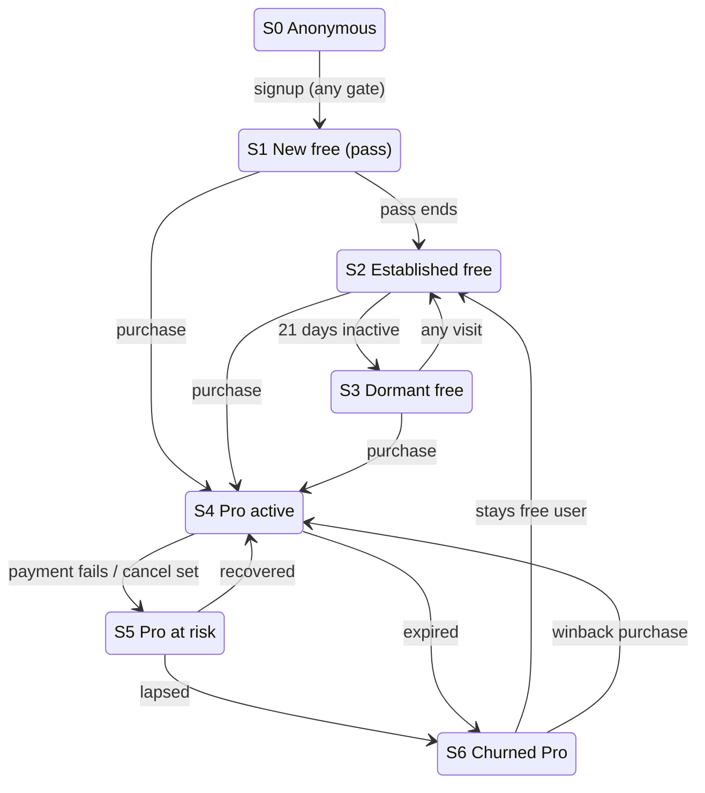

# Email program v2: the complete customer workflow

The umbrella SSOT for every email the site sends: who gets what, when, why,
and what decides between them. Bodies live in `email-copy-book.md`; this file
owns states, triggers, journeys, arbitration, consent, and the build order.
Supersedes the sequence sections of `newsletter-email-program-plan.md` and
extends `free-user-onboarding-plan.md` s3b/s5/s6.

## 0. The voice contract (applies to every email, no exceptions)

Authentic, friendly, concise, natural speaking voice. Every email sounds like
Selva wrote it to one person, because he effectively did.

- The read-aloud test: if a sentence sounds like a company, rewrite it until
  it sounds like a person. "We're excited to announce" fails. "This is live
  now, here is what it does for you" passes.
- Short. Most emails under 120 words. One idea, one CTA.
- Say the true thing plainly, including the uncomfortable true thing ("after
  {date} the track moves to Pro"). Trust is the asset the whole program
  compounds.
- Never: "unlock", "supercharge", "level up", "journey", urgency theater,
  fake scarcity, em dashes, exclamation stacking, emoji in subjects.
- Numbers only from real data (P3, hard rule). A sentence whose token has no
  data is dropped, never faked.
- Reply-to selva@r-statistics.co on everything. Replies are the support
  channel and the best product feedback we have.

## 1. Sending infrastructure (decided, partially live)

| Layer | System | Status |
|---|---|---|
| Per-user sequences + events | ZeptoMail (funded ~6 months) | live, used by fulfilment/renewal/admin |
| Broadcasts (The Residual) | Zoho Campaigns, dedicated list | blocked on owner: token, list key, sender-domain DNS |
| Magic links | Supabase via ZeptoMail SMTP | live |
| Exactly-once ledger | `sent_emails (user_id, email_key)` | table live on both DBs |
| Engine | Cron Worker, daily at send hour + event senders inline | to build |
| Kill switch | `flag:email-engine` (master), plus per-sender flags | to build |

Headers on every non-account send: `List-Unsubscribe` (one-click, RFC 8058;
Gmail requires it) and `utm_source=email&utm_campaign=<email_key>` on links.

## 2. The state model

**The core architectural rule: state is derived, never stored.** There is no
state-machine table, no "current step" pointer, no journey cursor that can
drift out of sync with reality. Every fact the engine needs already lives in
D1 (created_at, pro_until, attempts, lesson progress, certificates, consent,
the sent ledger), and the daily brain recomputes each user's state from those
facts at evaluation time. The only thing email sending ever writes is the
ledger row saying it sent. This is what makes the hard cases free: a user who
buys Pro on day 24 stops being eligible for the day-27 coupon the moment
their entitlement lands, because tomorrow's derivation puts them in S4 and
the arc queries simply no longer match. Nothing needed to be "cancelled".

Every account is in exactly one state. The engine evaluates state first,
then eligibility, then arbitration.

| State | Definition | Email goal |
|---|---|---|
| S0 Anonymous | no account | none (product surfaces do the talking) |
| S1 New free | day 0-30, pass window open | activate: first lesson, first solve, pass progress |
| S2 Established free | post-pass, active in last 21 days | habit: reps, recaps, milestones; convert on real intent |
| S3 Dormant free | no visit and no email open for 21 days | one honest winback, then near-silence |
| S4 Pro active | entitlement live | success: make the purchase keep feeling right |
| S5 Pro at risk | payment failed or cancel scheduled | recover with dignity, never guilt |
| S6 Churned Pro | entitlement lapsed | one winback at +30 days, then treat as S2/S3 |
| S7 Team | seat holder or org owner | owner: adoption; member: same as S4 with team framing |
| N Newsletter-only | on the Residual list, no account | broadcast only; soft path to an account |

State transitions the engine must handle: S1 to S2 at pass end (the arc
handles the moment), any to S3 by inactivity clock, S3 back to S2 on any
visit (re-awaken), S2/S3 to S4 on purchase, S4 to S5 on webhook, S5 to S4 on
recovery, S5/S4 to S6 on expiry. Because state is derived, a "transition" is
not an event we fire; it is just tomorrow's derivation coming out different.

## 3. Entry triggers and their welcomes

`users.signup_gate` (set once at signup) picks the welcome variant. All
welcome emails are category account, sent minutes after first confirmed
sign-in, and all name the pass and its end date.

| Trigger | signup_gate | Welcome (copy book) |
|---|---|---|
| Solved an exercise anonymously, signed up to keep it | exercise | 1a "Your first solve is saved" |
| Hit a lesson sign-in wall or account gate | lesson | 1b "Pick up where you left off" |
| Corner nudge, navbar, or direct signin | browsing | 1c "Your r-statistics.co account, in 30 seconds" |
| Accepted a team invite | team | NEW 9a (to write): seat welcome, from the org's context |
| Bought before creating history (rare) | purchase | Pro welcome 8a replaces the free welcome entirely |
| Newsletter-only subscriber | n/a (no account) | Campaigns confirmation only; no lifecycle emails |

Acquisition surfaces feeding these gates today: exercise hubs (win-first taster), lesson walls, tutorial nudges, pricing page. Surfaces with NO email capture today, listed as proposals, not commitments: the 73 tools ("email me this result"), the Publishing Handbook (chapter-updates list), assessments (cert follow-up; branch pending). Each would need its own consent language.

## 4. Consent and category law

The line that keeps us honest and legal (EU users especially):

| Category | Legal basis | Can it send without marketing opt-in? |
|---|---|---|
| account (welcome, cert, billing, security, the flip announcement) | contract / service | yes, always |
| progress (milestones, cap-hit, recaps) | legitimate interest | yes, individually opt-out-able in preferences |
| nurture (daily rep, streak-save) | consent | no: strictly opt-in via preference center |
| offers (pass arc days 21-31, intent) | soft opt-in for the pass arc (it concerns an entitlement they hold), consent for everything else | pass arc: yes with prominent opt-out; intent and future promos: marketing opt-in only |
| broadcast (The Residual) | consent | no: double-opt-in list only |

Owner decision to confirm: treating the pass arc as service-adjacent (it
describes an entitlement expiring) is defensible and standard, but the day-27
coupon inside it is promotional. Mitigation chosen: the coupon email honors
`marketing_opt_out` if the user has set it; days 21/23/30/31 still send.

Preference center (to build, /account.html email section): toggles for
progress, nurture-rep, offers, broadcast. Account cannot be toggled.
`unsubscribe all` sets everything off except account.

## 5. Arbitration: the one-brain rule, complete

Account/billing emails always send and never count. Everything else: max ONE
per user per day, chosen by priority. Higher wins; loser re-queues if still
relevant tomorrow, or drops if stale.

1. Pass deadline (day 27, 30) - a real clock beats everything
2. Payment recovery (ours, if any beyond Paddle's) - money already committed
3. Intent follow-up - they raised a hand yesterday
4. Cap hit - explains a wall they just hit
5. Pass progress (day 21, 23)
6. Milestone (cert first, then hub completion)
7. Streak save (opt-in nurture)
8. Daily rep (opt-in nurture)
9. Weekly recap
10. Broadcast day: the Residual (Campaigns, Thursdays). The engine skips rep
    and recap for Residual subscribers on Thursdays so nobody gets two.

Global guards: no email between 21:00 and 08:00 in the user's likely
timezone (from signup country; UTC 13:00 when unknown). Sunset: 10
consecutive non-account sends with no opens drops the user to weekly recap
only; 6 more weeks silent drops to account-only. Any site visit fully
re-awakens.

## 6. Journeys, persona by persona

Day numbers count from account creation unless noted. Copy IDs from the
copy book; NEW = body still to be written there.

### Persona A: the practicer (came in through the exercise gate)

Anonymous: solves the taster, hits the gate, signs up to keep the XP.

| Day | Condition | Email |
|---|---|---|
| 0 | always | 1a Your first solve is saved |
| 1-20 | opted into nurture | 5a daily rep, at most |
| 7 | finished a hub | 3b You finished {hub} |
| any | 25th attempt of the month | 3d All 25 for this month, done |
| any | visited pricing / hit a wall | 3c Questions about Pro? (once ever) |
| 21 | has lesson progress | 2a pass recap |
| 23 | always | 2b one-week warning |
| 27 | marketing not opted out | 2c the 23% coupon |
| 30 | always | 2d last day |
| 31 | always | 2e what stays free |
| 32+ | active | S2: reps, recaps, milestones |
| 32+ | inactive 21 days | S3: one winback (NEW 10a), then quiet |

### Persona B: the course learner (lesson wall signup)

Same spine as A with two differences: welcome is 1b (points back at the
exact lesson), and the pass arc is the main event because their whole intent
is the track. Milestone emphasis shifts from hubs to lesson sections.

### Persona C: the browser (nudge signup, low intent)

Welcome 1c. No taster, often no early activity. The risk is silence into
dormancy, the sin would be nagging.

| Day | Condition | Email |
|---|---|---|
| 0 | always | 1c account in 30 seconds |
| 3 | zero activity so far | NEW 10b "Where to start" : one honest orientation email, once. If ignored, nothing further except the pass arc endpoints |
| 21-31 | pass arc | 2b, 2d, 2e only (no 2a: no progress to recap; 2c coupon only if they showed any activity, a coupon to a ghost is spam) |
| 35+ | still zero activity | account-only silence; they know where we are |

### Persona D: the existing account at the flip (one-time cohort)

| Day (from flip) | Email |
|---|---|
| 0 | 4 the flip announcement (account category, everyone) |
| 0-30 | the pass arc mapped onto flip-relative days, same conditions as A |
| n/a | everything else as their activity state dictates |

### Persona E: the buyer (Pro)

| Moment | Email |
|---|---|
| purchase | Paddle receipt + our fulfilment (live) |
| day 0 | NEW 8a Pro welcome: what just opened, the one best next step for THEIR track, and "reply if anything is off". Warm, short, zero upsell |
| day 7 | NEW 8b only if they have not opened a Pro lesson yet: "getting your money's worth" nudge, one link, once ever |
| renewal minus 7 | renewal reminder (live) |
| payment failed | Paddle dunning first; we add NEW 8c one plain-text note from Selva at +3 days if still failing ("card bounced, here is the fix link, no drama"). Verify Paddle's sends first so nobody gets doubles |
| cancel scheduled | NEW 8d confirm + one honest save: what they keep, what ends, one question ("what was missing?"). Never a guilt trip |
| expired +30 | NEW 8e winback, once: what changed since they left, current price, done |

### Persona F: the team

| Moment | Email |
|---|---|
| owner provisions seats | invite emails (live, invites.ts) |
| member accepts | NEW 9a seat welcome: what the seat includes, where to start, who their admin is |
| owner, day 14 | NEW 9b adoption note if seats sit unused: "5 of 8 seats active, here is a nudge template you can forward" |
| renewals/billing | account category, owner only |

### Persona G: newsletter-only

The Residual (6) weekly. Every issue carries one quiet line linking site
features. No lifecycle emails ever; the list is not a funnel to spam.

## 7. Architecture: how the graph actually runs

The mental model in one paragraph: **ZeptoMail is a pipe, not a brain.** It
has a send API and event webhooks, and no journey/automation features at all
(that is Zoho Campaigns territory, which we use only for the broadcast). All
logic lives in our Cloudflare stack. Correctness comes from three things:
facts in D1 (what the user did), the ledger (what we sent), and pure
functions from facts to "what sends today" (this file, §5-6, §7d). No queue,
no stored journey position, no sync problem.

### 7a. Two send paths, by freshness need

- **Event senders** (inline in existing endpoints, via `waitUntil`, arrive
  in minutes): welcome 1a/1b/1c after first confirmed sign-in, cert 3a after
  minting, Pro welcome 8a + fulfilment on the Paddle webhook, seat welcome
  9a on invite acceptance, cancel confirm 8d on the cancellation webhook.
  These are all category `account`, so they skip arbitration; each still
  checks its flag and the ledger before sending.
- **The daily brain** (a scheduled Worker on a Cron Trigger; Pages Functions
  cannot cron, so this is the one new deployable): everything else. Runs
  once a day per send band, derives each user's state, collects candidates,
  applies consent, applies arbitration, sends at most one, writes the
  ledger. v1 runs at 13:00 UTC for everyone; per-timezone bands are a later
  refinement, not a launch requirement.

### 7b. How "react to user actions" works without a queue

Actions do not push emails; they leave facts, and the brain reads facts.
The 25th attempt is a row in exercise_attempts; tomorrow's run derives "hit
the cap yesterday" and considers 3d. A pricing visit writes intent_signals
(already live); tomorrow's run considers 3c. A purchase changes pro_until;
tomorrow's run silently retires every free-tier candidate. The only emails
that need to feel instant are the account ones, and those are the inline
event senders above. This split (instant = inline, everything else = next
morning) is deliberate: a morning email about yesterday's milestone reads
as considered; three same-day emails read as surveillance.

### 7c. Exactly-once, sequence, and catch-up

- **Ledger**: `sent_emails (user_id, email_key, sent_at)` PK-deduped.
  One-shot emails use fixed keys (`welcome`, `pass-21`, `intent-1`);
  recurring ones use day-keys (`rep:2026-08-14`) or month-keys
  (`cap:2026-08`).
- **Sequence** is date math, not a cursor: "send pass-23" means today is
  pass day >= 23, pass-23 not in ledger, and today is inside its validity
  window. If the user was ineligible on the exact day, the window decides
  whether it sends late or never.
- **Catch-up semantics** (cron missed a day, or the engine launched after
  the cohort started): each email has a validity window (7d). Deadline
  emails may send late inside their window; celebration emails expire
  fast (a late "you finished the hub" is creepy, a late "your pass ends
  soon" is still useful). The day-27 coupon's 72h validity counts from
  SEND, never from schedule, so a late send never shortchanges anyone.

### 7d. Validity windows

| Email | Eligible | If the window passes |
|---|---|---|
| 1a/1b/1c welcome | first sign-in + 48h | drop (a week-late welcome is noise) |
| 10b orientation | day 3-5 | drop |
| 2a pass recap | day 21-22 | drop, 2b carries the arc |
| 2b one-week warning | day 23-25 | drop, 2c carries it |
| 2c coupon | day 27-29, expiry = send + 72h | drop, 2d/2e still name the coupon while valid |
| 2d last day | day 30 only, before ends_at | drop, 2e covers the landing |
| 2e what stays free | day 31-33 | drop |
| 3a cert | mint + 24h | send anyway (account) |
| 3b hub done | completion + 48h | drop |
| 3c intent | signal + 1 to 3 days | drop until a fresh signal |
| 3d cap hit | cap + 24h | drop (the in-product wall already told them) |
| 8b Pro nudge | day 7-10 | drop |
| 8e Pro winback | expiry + 30-37d | drop |
| 10a free winback | dormancy day 21-28 | drop until the next dormancy cycle |

### 7e. Journey exit rules (mostly free, from derivation)

- Purchase mid-arc: all pass/offer/free-tier candidates vanish next run.
- Refund or chargeback: back to free states, but the ledger prevents any
  arc email from repeating; they rejoin wherever the dates say they are.
- Pass expired: 2d hard-checks `now < ends_at` besides its window.
- Bounce: `email_status=bounced` suppresses everything including account
  sends until the address changes. Complaint (spam report): same, forever.
- Deleted account: no user row, no candidates. Nothing to clean up.

### 7f. What ZeptoMail specifically gives us and needs from us

- **Send**: existing `_lib/email.ts` (single-send API, token in secret).
  Add `_lib/email-templates.ts`: render copy-book bodies, fill tokens,
  drop token-carrying sentences whose data is empty (P3 in code).
- **Events**: ZeptoMail webhooks (delivery, open, click, bounce) POST to a
  new `/api/webhooks/zeptomail` receiver, verified by shared secret,
  writing `email_events (user_id, email_key, event, at)`. This feeds
  opens-based sunset, bounce suppression, and §8 metrics.
- **Does NOT give us**: journeys, delays, branching, suppression logic,
  preference pages. All ours, all in the brain. This is the right trade:
  the logic stays in one place, in code, versioned, testable.

### 7g. Infra build list (complete)

1. Schema: `email_events` table; `users.email_status` + three consent
   columns (`email_progress`, `email_nurture`, `email_offers`, default on,
   on, off); apply to both DBs.
2. `/api/webhooks/zeptomail` receiver.
3. `_lib/email-templates.ts` (bodies from the copy book, token filling,
   drop-if-empty).
4. Event senders wired into their existing endpoints (welcome x3, cert,
   8a, 8d, 9a).
5. The brain: a scheduled Worker (`workers/email-brain/`, own wrangler
   config, same D1/KV bindings). Daily cron. Modules: derive-state,
   candidates, consent, arbitration, send, ledger.
6. Preference center section in /account.html against the consent columns.
7. Admin dry-run: `GET /api/admin/email-plan?date=` returns who would get
   what and why (the WHY is the arbitration trace), plus a
   `?send_test=<email_key>` that sends any email to the allowlist only.
   This is how every email gets eyeballed in a real inbox before its flag
   ever turns on.

### 7h. Flags

`email-engine` master kill switch checked by the brain and every event
sender; per-email flags as named in the copy book. Everything defaults off.
The flip turns on: welcome x3, cert, cap-hit, the arc. Nurture waits for
the preference center; Pro/team/winback ship in their build-order slots.

## 8. Measurement (what tells us it works)

- Per email: sends, opens, clicks (UTM), unsubscribes. Kill any email whose
  unsub rate beats its click rate for two consecutive months.
- Program: gate-to-signup rate (GA4 win/gate card events, already live),
  welcome open rate, day-7 activation (any solve or lesson), pass completion
  %, day-27 coupon redemptions (Paddle), free-to-Pro conversion by persona,
  dormancy rate, winback resurrection rate.
- The one number for the program: monthly free-to-Pro conversions attributed
  to an email click or coupon, against the baseline before the flip.

## 9. Copy debt

**Resolved 2026-08-12: all nine bodies written** (copy book sections 8-10:
Pro lifecycle 8a-8e, team 9a-9b, winback/orientation 10a-10b). Streak-save
remains deliberately NOT committed: it is the highest-nag-risk email in the
set; decide after the rep's open data exists. The Residual stays per-issue.

Transparency rule adopted with them: every non-account email's footer opens
with the specific reason it sent ("You get this because your Data Analyst
pass ends this week"), then the preferences and unsubscribe links. Nobody
should ever wonder why we wrote to them.

## 10. Build order

1. Schema (7g.1) + ZeptoMail webhook receiver (7g.2): small, unblocks metrics
2. Templates lib (7g.3) + event senders (7g.4): welcome x3 + cert first
3. The brain Worker (7g.5) with ONLY the pass arc + cap-hit, plus the admin
   dry-run (7g.7): the flip's needs, eyeballed via allowlist test sends
4. Preference center (7g.6), then nurture rep + recap
5. Pro lifecycle senders (8a/8d inline; 8b/8c/8e in the brain) + team 9a/9b
6. Winbacks 10a/10b, sunset automation
7. Campaigns provisioning (owner) then The Residual issue 1

Steps 1-3 are the flip dependency; everything after ships incrementally.
Every new email follows the same ritual: body in the copy book, template in
code, allowlist test send, real-inbox eyeball, then its flag turns on.
