```{r setup, include=FALSE}
knitr::opts_chunk$set(echo = TRUE, interval = .2, eval = FALSE, fig.asp = 0.618, fig.width = 6, fig.align = 'center')
```

# Top 50 ggplot2 Visualizations - The Master List (With Full R Code)

> What type of visualization to use for what sort of problem? This tutorial helps you choose the right type of chart for your specific objectives and how to implement it in R using ggplot2.

This is part 3 of a three part tutorial on ggplot2, an aesthetically pleasing (and very popular) graphics framework in R. This tutorial is primarily geared towards those having some basic knowledge of the R programming language and want to make complex and nice looking charts with R ggplot2. 

 * [Part 1: Introduction to ggplot2](Complete-Ggplot2-Tutorial-Part1-With-R-Code.html), covers the basic knowledge about constructing simple ggplots and modifying the components and aesthetics.
 
 * [Part 2: Customizing the Look and Feel](Complete-Ggplot2-Tutorial-Part2-Customizing-Theme-With-R-Code.html), is about more advanced customization like manipulating legend, annotations, multiplots with faceting and custom layouts
 
 * [Part 3: Top 50 ggplot2 Visualizations - The Master List](Top50-Ggplot2-Visualizations-MasterList-R-Code.html), applies what was learnt in part 1 and 2 to construct other types of ggplots such as bar charts, boxplots etc.


### <a name="top"></a>Top 50 ggplot2 Visualizations - The Master List

An effective chart is one that:

 1. Conveys the right information without distorting facts.
 2. Is simple but elegant. It should not force you to think much in order to get it.
 3. Aesthetics supports information rather that overshadow it.
 4. Is not overloaded with information.

The list below sorts the visualizations based on its primary purpose. Primarily, there are 8 types of objectives you may construct plots. So, before you actually make the plot, try and figure what findings and relationships you would like to convey or examine through the visualization. Chances are it will fall under one (or sometimes more) of these 8 categories.

1. [Correlation](Top50-Ggplot2-Visualizations-MasterList-R-Code.html#1. Correlation)
    * [Scatterplot](Top50-Ggplot2-Visualizations-MasterList-R-Code.html#Scatterplot)
    * [Scatterplot With Encircling](#Scatterplot With Encircling)
    * [Jitter Plot](Top50-Ggplot2-Visualizations-MasterList-R-Code.html#Jitter Plot)
    * [Counts Chart](Top50-Ggplot2-Visualizations-MasterList-R-Code.html#Counts Chart)
    * [Bubble Plot](Top50-Ggplot2-Visualizations-MasterList-R-Code.html#Bubble Plot)
    * [Animated Bubble Plot](Top50-Ggplot2-Visualizations-MasterList-R-Code.html#Animated Bubble Plot)
    * [Marginal Histogram / Boxplot](Top50-Ggplot2-Visualizations-MasterList-R-Code.html#Marginal Histogram / Boxplot)
    * [Correlogram](Top50-Ggplot2-Visualizations-MasterList-R-Code.html#Correlogram)
  
2. [Deviation](Top50-Ggplot2-Visualizations-MasterList-R-Code.html#2. Deviation)
    * [Diverging Bars](Top50-Ggplot2-Visualizations-MasterList-R-Code.html#Diverging Bars)
    * [Diverging Lollipop Chart](Top50-Ggplot2-Visualizations-MasterList-R-Code.html#Diverging Lollipop Chart)
    * [Diverging Dot Plot](Top50-Ggplot2-Visualizations-MasterList-R-Code.html#Diverging Dot Plot)
    * [Area Chart](Top50-Ggplot2-Visualizations-MasterList-R-Code.html#Area Chart)
    
3. [Ranking](Top50-Ggplot2-Visualizations-MasterList-R-Code.html#3. Ranking)
    * [Ordered Bar Chart](Top50-Ggplot2-Visualizations-MasterList-R-Code.html#Ordered Bar Chart)
    * [Lollipop Chart](Top50-Ggplot2-Visualizations-MasterList-R-Code.html#Lollipop Chart)
    * [Dot Plot](Top50-Ggplot2-Visualizations-MasterList-R-Code.html#Dot Plot)
    * [Slope Chart](Top50-Ggplot2-Visualizations-MasterList-R-Code.html#Slope Chart)
    * [Dumbbell Plot](Top50-Ggplot2-Visualizations-MasterList-R-Code.html#Dumbbell Plot)
  
4. [Distribution](Top50-Ggplot2-Visualizations-MasterList-R-Code.html#4. Distribution)
    * [Histogram](Top50-Ggplot2-Visualizations-MasterList-R-Code.html#Histogram)
    * [Density Plot](Top50-Ggplot2-Visualizations-MasterList-R-Code.html#Density Plot)
    * [Box Plot](Top50-Ggplot2-Visualizations-MasterList-R-Code.html#Box Plot)
    * [Dot + Box Plot](Top50-Ggplot2-Visualizations-MasterList-R-Code.html#Dot + Box Plot)
    * [Tufte Boxplot](Top50-Ggplot2-Visualizations-MasterList-R-Code.html#Tufte Boxplot)
    * [Violin Plot](Top50-Ggplot2-Visualizations-MasterList-R-Code.html#Violin Plot)
    * [Population Pyramid](Top50-Ggplot2-Visualizations-MasterList-R-Code.html#Population Pyramid)
    
5. [Composition](Top50-Ggplot2-Visualizations-MasterList-R-Code.html#5. Composition)
    * [Waffle Chart](#Waffle Chart)
    * [Pie Chart](#Pie Chart)
    * [Treemap](Top50-Ggplot2-Visualizations-MasterList-R-Code.html#Treemap)
    * [Bar Chart](#Bar Chart)
    
6. [Change](Top50-Ggplot2-Visualizations-MasterList-R-Code.html#6. Change)
    * [Time Series Plots](#Time Series Plot From a Time Series Object)
        + [From a Data Frame](#Time Series Plot From a Data Frame)
        + [Format to Monthly X Axis](#Time Series Plot For a Monthly Time Series)
        + [Format to Yearly X Axis](#Time Series Plot For a Yearly Time Series)
        + [From Long Data Format](#Time Series Plot From Long Data Format)
        + [From Wide Data Format](Top50-Ggplot2-Visualizations-MasterList-R-Code.html#Time Series Plot From  Wide Data Format)
    * [Stacked Area Chart](#Stacked Area Chart)
    * [Calendar Heat Map](#Calendar Heat Map)
    * [Slope Chart](#Slope Chart 2)
    * [Seasonal Plot](#Seasonal Plot)
    
7. [Groups](Top50-Ggplot2-Visualizations-MasterList-R-Code.html#7. Groups)
    * [Dendrogram](#Hierarchical Dendrogram)
    * [Clusters](Top50-Ggplot2-Visualizations-MasterList-R-Code.html#Clusters)

8. [Spatial](Top50-Ggplot2-Visualizations-MasterList-R-Code.html#8. Spatial)
    * [Open Street Map](#Open Street Map)
    * [Google Road Map](#Google Road Map)
    * [Google Hybrid Map](#Google Hybrid Map)

## 1. Correlation

The following plots help to examine how well correlated two variables are.

### <a name="Scatterplot"></a>Scatterplot

The most frequently used plot for data analysis is undoubtedly the scatterplot. Whenever you want to understand the nature of relationship between two variables, invariably the first choice is the scatterplot.

It can be drawn using `geom_point()`. Additionally, `geom_smooth` which draws a smoothing line (based on loess) by default, can be tweaked to draw the line of best fit by setting `method='lm'`. 

```{r}
# install.packages("ggplot2")
# load package and data
options(scipen=999)  # turn-off scientific notation like 1e+48
library(ggplot2)
theme_set(theme_bw())  # pre-set the bw theme.
data("midwest", package = "ggplot2")
# midwest <- read.csv("http://goo.gl/G1K41K")  # bkup data source

# Scatterplot
gg <- ggplot(midwest, aes(x=area, y=poptotal)) + 
  geom_point(aes(col=state, size=popdensity)) + 
  geom_smooth(method="loess", se=F) + 
  xlim(c(0, 0.1)) + 
  ylim(c(0, 500000)) + 
  labs(subtitle="Area Vs Population", 
       y="Population", 
       x="Area", 
       title="Scatterplot", 
       caption = "Source: midwest")

plot(gg)
```


<a href="#top">[Back to Top]</a>

### <a name="Scatterplot With Encircling"></a>Scatterplot With Encircling

When presenting the results, sometimes I would encirlce certain special group of points or region in the chart so as to draw the attention to those peculiar cases. This can be conveniently done using the `geom_encircle()` in `ggalt` package. 

Within `geom_encircle()`, set the `data` to a new dataframe that contains only the points (rows) or interest.  Moreover, You can `expand` the curve so as to pass just outside the points. The `color` and `size` (thickness) of the curve can be modified as well. See below example.

```{r}
# install 'ggalt' pkg
# devtools::install_github("hrbrmstr/ggalt")
options(scipen = 999)
library(ggplot2)
library(ggalt)
midwest_select <- midwest[midwest$poptotal > 350000 & 
                            midwest$poptotal <= 500000 & 
                            midwest$area > 0.01 & 
                            midwest$area < 0.1, ]

# Plot
ggplot(midwest, aes(x=area, y=poptotal)) + 
  geom_point(aes(col=state, size=popdensity)) +   # draw points
  geom_smooth(method="loess", se=F) + 
  xlim(c(0, 0.1)) + 
  ylim(c(0, 500000)) +   # draw smoothing line
  geom_encircle(aes(x=area, y=poptotal), 
                data=midwest_select, 
                color="red", 
                size=2, 
                expand=0.08) +   # encircle
  labs(subtitle="Area Vs Population", 
       y="Population", 
       x="Area", 
       title="Scatterplot + Encircle", 
       caption="Source: midwest")
```


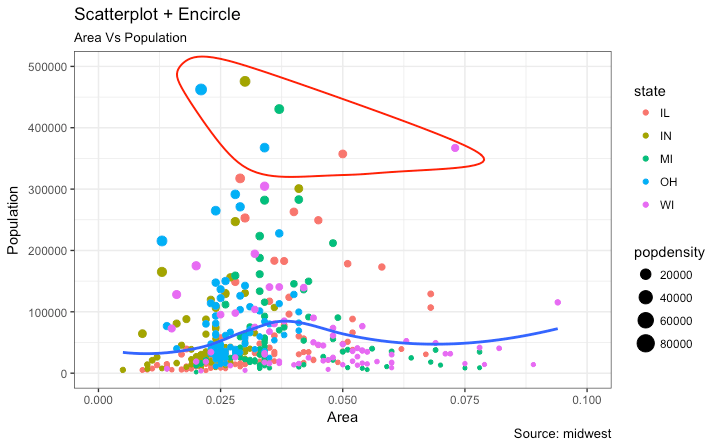
<a href="#top">[Back to Top]</a>

### <a name="Jitter Plot"></a>Jitter Plot 
Let's look at a new data to draw the scatterplot. This time, I will use the `mpg` dataset to plot city mileage (`cty`) vs highway mileage (`hwy`).

```{r}
# load package and data
library(ggplot2)
data(mpg, package="ggplot2") # alternate source: "http://goo.gl/uEeRGu")
theme_set(theme_bw())  # pre-set the bw theme.

g <- ggplot(mpg, aes(cty, hwy))

# Scatterplot
g + geom_point() + 
  geom_smooth(method="lm", se=F) +
  labs(subtitle="mpg: city vs highway mileage", 
       y="hwy", 
       x="cty", 
       title="Scatterplot with overlapping points", 
       caption="Source: midwest")
```
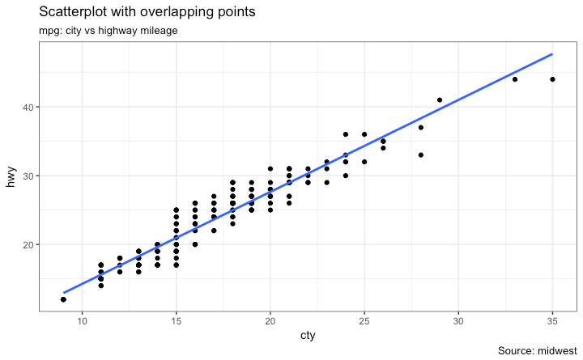

What we have here is a scatterplot of city and highway mileage in `mpg` dataset. We have seen a similar scatterplot and this looks neat and gives a clear idea of how the city mileage (`cty`) and highway mileage (`hwy`) are well correlated.

But, this innocent looking plot is _hiding_ something. Can you find out? 

```{r}
dim(mpg)
```

The original data has 234 data points but the chart seems to display fewer points. What has happened? This is because there are many overlapping points appearing as a single dot. The fact that both `cty` and `hwy` are integers in the source dataset made it all the more convenient to hide this detail. So just be extra careful the next time you make scatterplot with integers.

So how to handle this? There are few options. We can make a jitter plot with `jitter_geom()`. As the name suggests, the overlapping points are randomly jittered around its original position based on a threshold controlled by the `width` argument.
```{r}
# load package and data
library(ggplot2)
data(mpg, package="ggplot2")
# mpg <- read.csv("http://goo.gl/uEeRGu")

# Scatterplot
theme_set(theme_bw())  # pre-set the bw theme.
g <- ggplot(mpg, aes(cty, hwy))
g + geom_jitter(width = .5, size=1) +
  labs(subtitle="mpg: city vs highway mileage", 
       y="hwy", 
       x="cty", 
       title="Jittered Points")
```
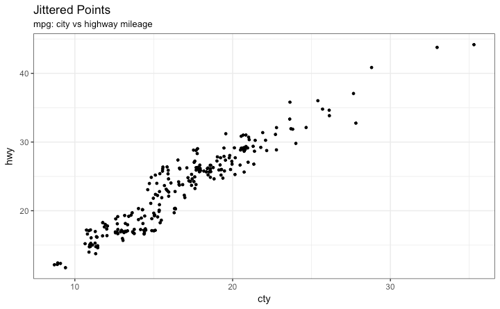
More points are revealed now. More the `width`, more the points are moved jittered from their original position.

<a href="#top">[Back to Top]</a>

### <a name="Counts Chart"></a>Counts Chart
The second option to overcome the problem of data points overlap is to use what is called a _counts chart_. Whereever there is more points overlap, the size of the circle gets bigger.
```{r}
# load package and data
library(ggplot2)
data(mpg, package="ggplot2")
# mpg <- read.csv("http://goo.gl/uEeRGu")

# Scatterplot
theme_set(theme_bw())  # pre-set the bw theme.
g <- ggplot(mpg, aes(cty, hwy))
g + geom_count(col="tomato3", show.legend=F) +
  labs(subtitle="mpg: city vs highway mileage", 
       y="hwy", 
       x="cty", 
       title="Counts Plot")
```
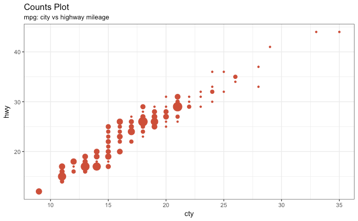

<a href="#top">[Back to Top]</a>

### <a name="Bubble Plot"></a>Bubble plot
While scatterplot lets you compare the relationship between 2 continuous variables, bubble chart serves well if you want to understand relationship within the underlying groups based on:

1. A Categorical variable (by changing the color) and 
2. Another continuous variable (by changing the size of points). 

In simpler words, bubble charts are more suitable if you have 4-Dimensional data where two of them are numeric (X and Y) and one other categorical (color) and another numeric variable (size). 

The bubble chart clearly distinguishes the range of `displ` between the manufacturers and how the slope of lines-of-best-fit varies, providing a better visual comparison between the groups.

```{r}
# load package and data
library(ggplot2)
data(mpg, package="ggplot2")
# mpg <- read.csv("http://goo.gl/uEeRGu")

mpg_select <- mpg[mpg$manufacturer %in% c("audi", "ford", "honda", "hyundai"), ]

# Scatterplot
theme_set(theme_bw())  # pre-set the bw theme.
g <- ggplot(mpg_select, aes(displ, cty)) + 
  labs(subtitle="mpg: Displacement vs City Mileage",
       title="Bubble chart")

g + geom_jitter(aes(col=manufacturer, size=hwy)) + 
  geom_smooth(aes(col=manufacturer), method="lm", se=F)
```


<a href="#top">[Back to Top]</a>

### <a name="Animated Bubble Plot"></a>Animated Bubble chart
An animated bubble chart can be implemented using the `gganimate` package. It is same as the bubble chart, but, you have to show how the values change over a fifth dimension (typically time).

The key thing to do is to set the `aes(frame)` to the desired column on which you want to animate. Rest of the procedure related to plot construction is the same. Once the plot is constructed, you can animate it using `gganimate()` by setting a chosen `interval`.

```{r, interval = .2}
# Source: https://github.com/dgrtwo/gganimate
# install.packages("cowplot")  # a gganimate dependency
# devtools::install_github("dgrtwo/gganimate")
library(ggplot2)
library(gganimate)
library(gapminder)
theme_set(theme_bw())  # pre-set the bw theme.

g <- ggplot(gapminder, aes(gdpPercap, lifeExp, size = pop, frame = year)) +
  geom_point() +
  geom_smooth(aes(group = year), 
              method = "lm", 
              show.legend = FALSE) +
  facet_wrap(~continent, scales = "free") +
  scale_x_log10()  # convert to log scale

gganimate(g, interval=0.2)
```


<a href="#top">[Back to Top]</a>

### <a name="Marginal Histogram / Boxplot"></a>Marginal Histogram / Boxplot

If you want to show the relationship as well as the distribution in the same chart, use the marginal histogram. It has a histogram of the X and Y variables at the margins of the scatterplot. 

This can be implemented using the `ggMarginal()` function from the '`ggExtra`' package. Apart from a `histogram`, you could choose to draw a marginal `boxplot` or `density` plot by setting the respective `type` option.

```{r}
# load package and data
library(ggplot2)
library(ggExtra)
data(mpg, package="ggplot2")
# mpg <- read.csv("http://goo.gl/uEeRGu")

# Scatterplot
theme_set(theme_bw())  # pre-set the bw theme.
mpg_select <- mpg[mpg$hwy >= 35 & mpg$cty > 27, ]
g <- ggplot(mpg, aes(cty, hwy)) + 
  geom_count() + 
  geom_smooth(method="lm", se=F)

ggMarginal(g, type = "histogram", fill="transparent")
ggMarginal(g, type = "boxplot", fill="transparent")
# ggMarginal(g, type = "density", fill="transparent")
```
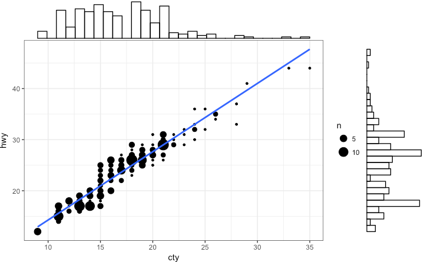
<br>
<br>
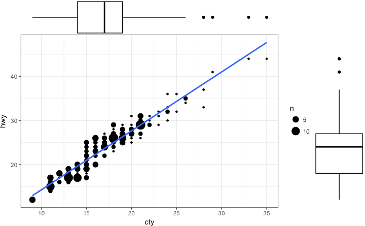

<a href="#top">[Back to Top]</a>

### <a name="Correlogram"></a>Correlogram

Correlogram let's you examine the corellation of multiple continuous variables present in the same dataframe. This is conveniently implemented using the `ggcorrplot` package.
```{r}
# devtools::install_github("kassambara/ggcorrplot")
library(ggplot2)
library(ggcorrplot)

# Correlation matrix
data(mtcars)
corr <- round(cor(mtcars), 1)

# Plot
ggcorrplot(corr, hc.order = TRUE, 
           type = "lower", 
           lab = TRUE, 
           lab_size = 3, 
           method="circle", 
           colors = c("tomato2", "white", "springgreen3"), 
           title="Correlogram of mtcars", 
           ggtheme=theme_bw)
```
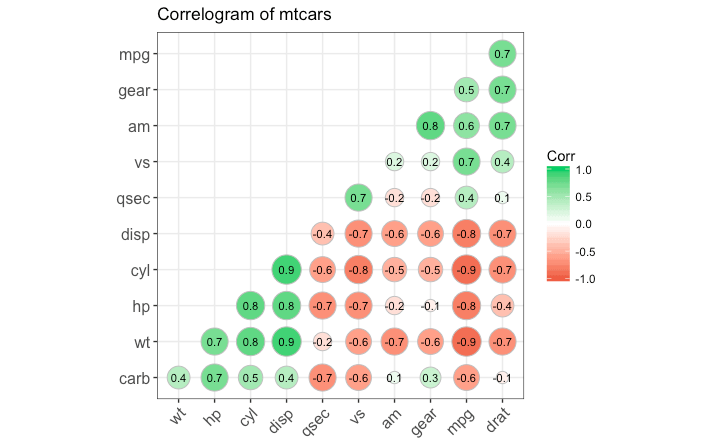

<a href="#top">[Back to Top]</a>

## 2. Deviation 
Compare variation in _values_ between small number of items (or categories) with respect to a fixed reference. 

### <a name="Diverging Bars"></a>Diverging bars
Diverging Bars is a bar chart that can handle both negative and positive values. This can be implemented by a smart tweak with `geom_bar()`. But the usage of `geom_bar()` can be quite confusing. Thats because, it can be used to make a bar chart as well as a histogram. Let me explain.

By default, `geom_bar()` has the `stat` set to `count`. That means, when you provide just a continuous X variable (and no Y variable), it tries to make a histogram out of the data. 

In order to make a bar chart create bars instead of histogram, you need to do two things. 

1. Set `stat=identity` 
2. Provide both `x` and `y` inside `aes()` where, `x` is either `character` or `factor` and `y` is numeric.

In order to make sure you get diverging bars instead of just bars, make sure, your categorical variable has 2 categories that changes values at a certain threshold of the continuous variable. In below example, the `mpg` from mtcars dataset is normalised by computing the z score. Those vehicles with mpg above zero are marked green and those below are marked red.

```{r}
library(ggplot2)
theme_set(theme_bw())  

# Data Prep
data("mtcars")  # load data
mtcars$`car name` <- rownames(mtcars)  # create new column for car names
mtcars$mpg_z <- round((mtcars$mpg - mean(mtcars$mpg))/sd(mtcars$mpg), 2)  # compute normalized mpg
mtcars$mpg_type <- ifelse(mtcars$mpg_z < 0, "below", "above")  # above / below avg flag
mtcars <- mtcars[order(mtcars$mpg_z), ]  # sort
mtcars$`car name` <- factor(mtcars$`car name`, levels = mtcars$`car name`)  # convert to factor to retain sorted order in plot.

# Diverging Barcharts
ggplot(mtcars, aes(x=`car name`, y=mpg_z, label=mpg_z)) + 
  geom_bar(stat='identity', aes(fill=mpg_type), width=.5)  +
  scale_fill_manual(name="Mileage", 
                    labels = c("Above Average", "Below Average"), 
                    values = c("above"="#00ba38", "below"="#f8766d")) + 
  labs(subtitle="Normalised mileage from 'mtcars'", 
       title= "Diverging Bars") + 
  coord_flip()
```
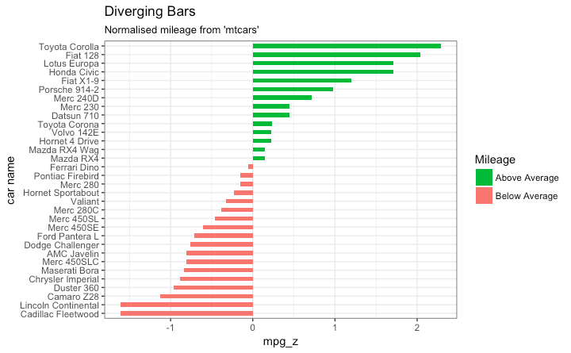

<a href="#top">[Back to Top]</a>

### <a name="Diverging Lollipop Chart"></a>Diverging Lollipop Chart
Lollipop chart conveys the same information as bar chart and diverging bar. Except that it looks more modern. Instead of geom_bar, I use `geom_point` and `geom_segment` to get the lollipops right. Let's draw a lollipop using the same data I prepared in the previous example of diverging bars.
```{r}
library(ggplot2)
theme_set(theme_bw())

ggplot(mtcars, aes(x=`car name`, y=mpg_z, label=mpg_z)) + 
  geom_point(stat='identity', fill="black", size=6)  +
  geom_segment(aes(y = 0, 
                   x = `car name`, 
                   yend = mpg_z, 
                   xend = `car name`), 
               color = "black") +
  geom_text(color="white", size=2) +
  labs(title="Diverging Lollipop Chart", 
       subtitle="Normalized mileage from 'mtcars': Lollipop") + 
  ylim(-2.5, 2.5) +
  coord_flip()
```
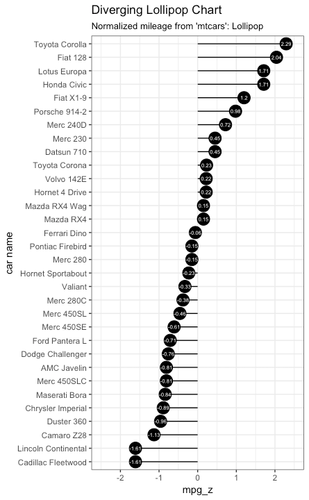

<a href="#top">[Back to Top]</a>

### <a name="Diverging Dot Plot"></a>Diverging Dot Plot
Dot plot conveys similar information. The principles are same as what we saw in Diverging bars, except that only point are used. Below example uses the same data prepared in the [diverging bars example](Top50-Ggplot2-Visualizations-MasterList-R-Code.html#Diverging Bars).
```{r}
library(ggplot2)
theme_set(theme_bw())

# Plot
ggplot(mtcars, aes(x=`car name`, y=mpg_z, label=mpg_z)) + 
  geom_point(stat='identity', aes(col=mpg_type), size=6)  +
  scale_color_manual(name="Mileage", 
                     labels = c("Above Average", "Below Average"), 
                     values = c("above"="#00ba38", "below"="#f8766d")) + 
  geom_text(color="white", size=2) +
  labs(title="Diverging Dot Plot", 
       subtitle="Normalized mileage from 'mtcars': Dotplot") + 
  ylim(-2.5, 2.5) +
  coord_flip()
```
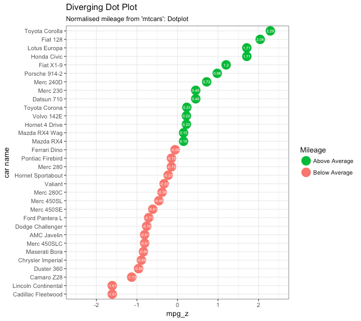

<a href="#top">[Back to Top]</a>

### <a name="Area Chart"></a>Area Chart
Area charts are typically used to visualize how a particular metric (such as % returns from a stock) performed compared to a certain baseline. Other types of %returns or %change data are also commonly used. The `geom_area()` implements this.

```{r}
library(ggplot2)
library(quantmod)
data("economics", package = "ggplot2")

# Compute % Returns
economics$returns_perc <- c(0, diff(economics$psavert)/economics$psavert[-length(economics$psavert)])

# Create break points and labels for axis ticks
brks <- economics$date[seq(1, length(economics$date), 12)]
lbls <- lubridate::year(economics$date[seq(1, length(economics$date), 12)])

# Plot
ggplot(economics[1:100, ], aes(date, returns_perc)) + 
  geom_area() + 
  scale_x_date(breaks=brks, labels=lbls) + 
  theme(axis.text.x = element_text(angle=90)) + 
  labs(title="Area Chart", 
       subtitle = "Perc Returns for Personal Savings", 
       y="% Returns for Personal savings", 
       caption="Source: economics")
```
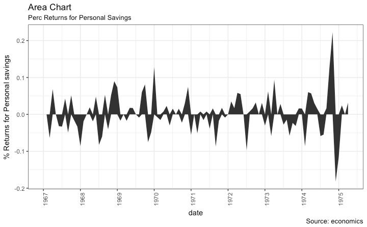

<a href="#top">[Back to Top]</a>

## 3. Ranking
Used to compare the position or performance of multiple items with respect to each other. Actual values matters somewhat less than the ranking.

### <a name="Ordered Bar Chart"></a>Ordered Bar Chart
Ordered Bar Chart is a Bar Chart that is ordered by the Y axis variable. Just sorting the dataframe by the variable of interest isn't enough to order the bar chart. In order for the bar chart to retain the order of the rows, the X axis variable (i.e. the categories) has to be converted into a factor.

Let's plot the mean city mileage for each manufacturer from `mpg` dataset. First, aggregate the data and sort it before you draw the plot. Finally, the X variable is converted to a factor.

Let's see how that is done.
```{r}
# Prepare data: group mean city mileage by manufacturer.
cty_mpg <- aggregate(mpg$cty, by=list(mpg$manufacturer), FUN=mean)  # aggregate
colnames(cty_mpg) <- c("make", "mileage")  # change column names
cty_mpg <- cty_mpg[order(cty_mpg$mileage), ]  # sort
cty_mpg$make <- factor(cty_mpg$make, levels = cty_mpg$make)  # to retain the order in plot.
head(cty_mpg, 4)
#>          make  mileage
#> 9     lincoln 11.33333
#> 8  land rover 11.50000
#> 3       dodge 13.13514
#> 10    mercury 13.25000

```

The X variable is now a `factor`, let's plot.
```{r}
library(ggplot2)
theme_set(theme_bw())

# Draw plot
ggplot(cty_mpg, aes(x=make, y=mileage)) + 
  geom_bar(stat="identity", width=.5, fill="tomato3") + 
  labs(title="Ordered Bar Chart", 
       subtitle="Make Vs Avg. Mileage", 
       caption="source: mpg") + 
  theme(axis.text.x = element_text(angle=65, vjust=0.6))
```
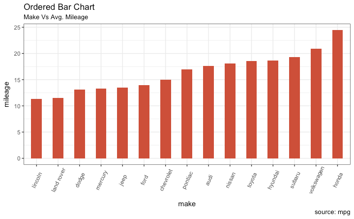

<a href="#top">[Back to Top]</a>

### <a name="Lollipop Chart"></a>Lollipop Chart 
Lollipop charts conveys the same information as in bar charts. By reducing the thick bars into thin lines, it reduces the clutter and lays more emphasis on the value. It looks nice and modern.

```{r}
library(ggplot2)
theme_set(theme_bw())

# Plot
ggplot(cty_mpg, aes(x=make, y=mileage)) + 
  geom_point(size=3) + 
  geom_segment(aes(x=make, 
                   xend=make, 
                   y=0, 
                   yend=mileage)) + 
  labs(title="Lollipop Chart", 
       subtitle="Make Vs Avg. Mileage", 
       caption="source: mpg") + 
  theme(axis.text.x = element_text(angle=65, vjust=0.6))
```
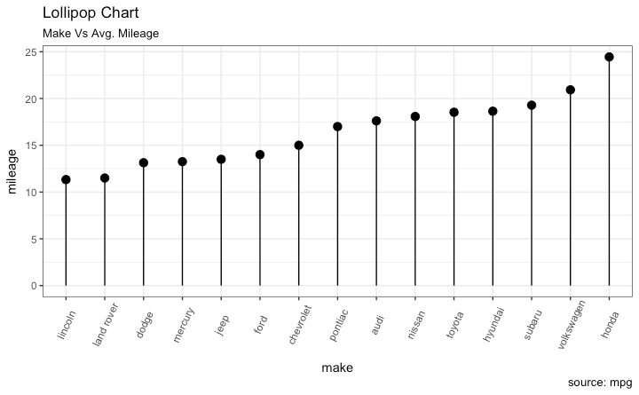

<a href="#top">[Back to Top]</a>

### <a name="Dot Plot"></a>Dot Plot
Dot plots are very similar to lollipops, but without the line and is flipped to horizontal position. It emphasizes more on the rank ordering of items with respect to actual values and how far apart are the entities with respect to each other.
```{r}
library(ggplot2)
library(scales)
theme_set(theme_classic())

# Plot
ggplot(cty_mpg, aes(x=make, y=mileage)) + 
  geom_point(col="tomato2", size=3) +   # Draw points
  geom_segment(aes(x=make, 
                   xend=make, 
                   y=min(mileage), 
                   yend=max(mileage)), 
               linetype="dashed", 
               size=0.1) +   # Draw dashed lines
  labs(title="Dot Plot", 
       subtitle="Make Vs Avg. Mileage", 
       caption="source: mpg") +  
  coord_flip()
```
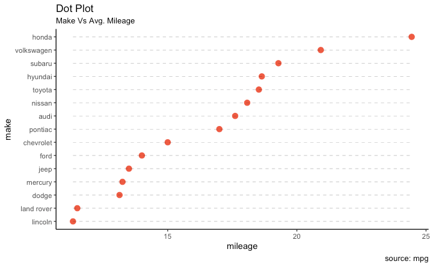

<a href="#top">[Back to Top]</a>

### <a name="Slope Chart"></a>Slope Chart
Slope charts are an excellent way of comparing the positional placements between 2 points on time. At the moment, there is no builtin function to construct this. Following code serves as a pointer about how you may approach this.
```{r}
library(ggplot2)
library(scales)
theme_set(theme_classic())

# prep data
df <- read.csv("https://raw.githubusercontent.com/selva86/datasets/master/gdppercap.csv")
colnames(df) <- c("continent", "1952", "1957")
left_label <- paste(df$continent, round(df$`1952`),sep=", ")
right_label <- paste(df$continent, round(df$`1957`),sep=", ")
df$class <- ifelse((df$`1957` - df$`1952`) < 0, "red", "green")

# Plot
p <- ggplot(df) + geom_segment(aes(x=1, xend=2, y=`1952`, yend=`1957`, col=class), size=.75, show.legend=F) + 
                  geom_vline(xintercept=1, linetype="dashed", size=.1) + 
                  geom_vline(xintercept=2, linetype="dashed", size=.1) +
                  scale_color_manual(labels = c("Up", "Down"), 
                                     values = c("green"="#00ba38", "red"="#f8766d")) +  # color of lines
                  labs(x="", y="Mean GdpPerCap") +  # Axis labels
                  xlim(.5, 2.5) + ylim(0,(1.1*(max(df$`1952`, df$`1957`))))  # X and Y axis limits

# Add texts
p <- p + geom_text(label=left_label, y=df$`1952`, x=rep(1, NROW(df)), hjust=1.1, size=3.5)
p <- p + geom_text(label=right_label, y=df$`1957`, x=rep(2, NROW(df)), hjust=-0.1, size=3.5)
p <- p + geom_text(label="Time 1", x=1, y=1.1*(max(df$`1952`, df$`1957`)), hjust=1.2, size=5)  # title
p <- p + geom_text(label="Time 2", x=2, y=1.1*(max(df$`1952`, df$`1957`)), hjust=-0.1, size=5)  # title

# Minify theme
p + theme(panel.background = element_blank(), 
           panel.grid = element_blank(),
           axis.ticks = element_blank(),
           axis.text.x = element_blank(),
           panel.border = element_blank(),
           plot.margin = unit(c(1,2,1,2), "cm"))
```
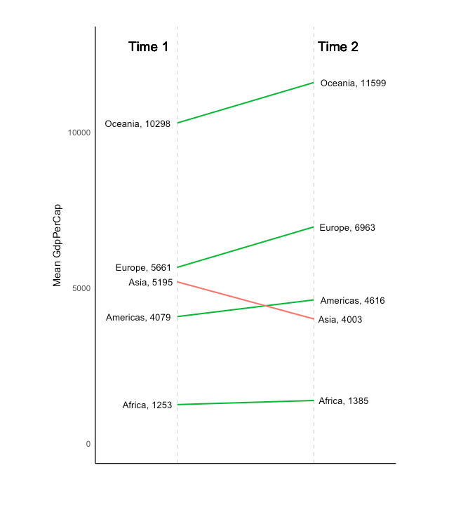

<a href="#top">[Back to Top]</a>

### <a name="Dumbbell Plot"></a>Dumbbell Plot
Dumbbell charts are a great tool if you wish to:
 1. Visualize relative positions (like growth and decline) between two points in time.
 2. Compare distance between two categories.

In order to get the correct ordering of the dumbbells, the Y variable should be a factor and the levels of the factor variable should be in the same order as it should appear in the plot.

```{r}
# devtools::install_github("hrbrmstr/ggalt")
library(ggplot2)
library(ggalt)
theme_set(theme_classic())

health <- read.csv("https://raw.githubusercontent.com/selva86/datasets/master/health.csv")
health$Area <- factor(health$Area, levels=as.character(health$Area))  # for right ordering of the dumbells

# health$Area <- factor(health$Area)
gg <- ggplot(health, aes(x=pct_2013, xend=pct_2014, y=Area, group=Area)) + 
        geom_dumbbell(color="#a3c4dc", 
                      size=0.75, 
                      point.colour.l="#0e668b") + 
        scale_x_continuous(label=percent) + 
        labs(x=NULL, 
             y=NULL, 
             title="Dumbbell Chart", 
             subtitle="Pct Change: 2013 vs 2014", 
             caption="Source: https://github.com/hrbrmstr/ggalt") +
        theme(plot.title = element_text(hjust=0.5, face="bold"),
              plot.background=element_rect(fill="#f7f7f7"),
              panel.background=element_rect(fill="#f7f7f7"),
              panel.grid.minor=element_blank(),
              panel.grid.major.y=element_blank(),
              panel.grid.major.x=element_line(),
              axis.ticks=element_blank(),
              legend.position="top",
              panel.border=element_blank())
plot(gg)
```
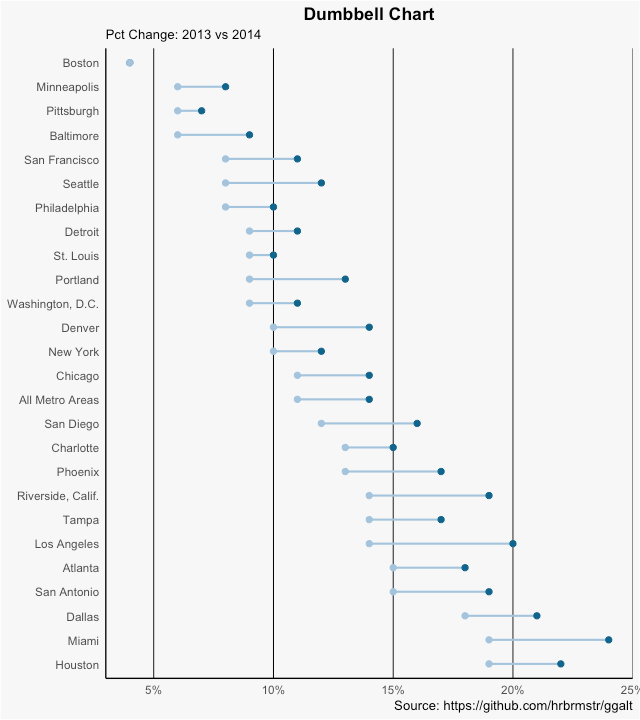

<a href="#top">[Back to Top]</a>

## 4. Distribution
When you have lots and lots of data points and want to study where and how the data points are distributed.

### <a name="Histogram"></a>Histogram 
By default, if only one variable is supplied, the `geom_bar()` tries to calculate the count. In order for it to behave like a bar chart, the `stat=identity` option has to be set and `x` and `y` values must be provided.


#### Histogram on a continuous variable
Histogram on a continuous variable can be accomplished using either `geom_bar()` or `geom_histogram()`. When using `geom_histogram()`, you can control the number of bars using the `bins` option. Else, you can set the range covered by each bin using `binwidth`. The value of `binwidth` is on the same scale as the continuous variable on which histogram is built.
Since, `geom_histogram` gives facility to control both number of `bins` as well as `binwidth`, it is the preferred option to create histogram on continuous variables.

```{r}
library(ggplot2)
theme_set(theme_classic())

# Histogram on a Continuous (Numeric) Variable
g <- ggplot(mpg, aes(displ)) + scale_fill_brewer(palette = "Spectral")

g + geom_histogram(aes(fill=class), 
                   binwidth = .1, 
                   col="black", 
                   size=.1) +  # change binwidth
  labs(title="Histogram with Auto Binning", 
       subtitle="Engine Displacement across Vehicle Classes")  

g + geom_histogram(aes(fill=class), 
                   bins=5, 
                   col="black", 
                   size=.1) +   # change number of bins
  labs(title="Histogram with Fixed Bins", 
       subtitle="Engine Displacement across Vehicle Classes") 
```
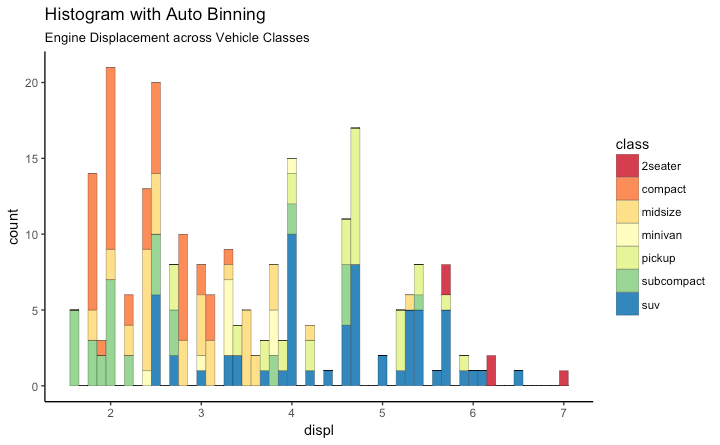
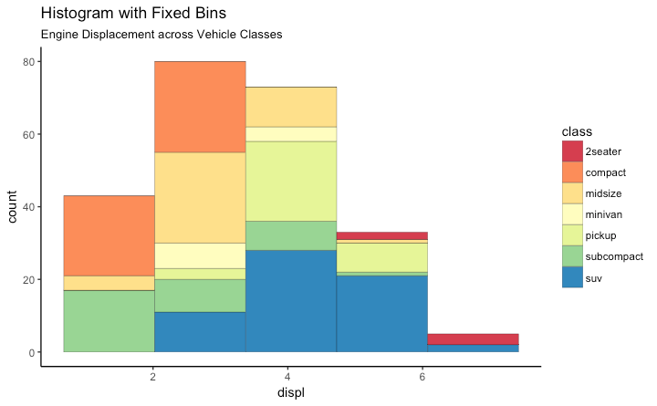

<a href="#top">[Back to Top]</a>

#### Histogram on a categorical variable
Histogram on a categorical variable would result in a frequency chart showing bars for each category. By adjusting `width`, you can adjust the thickness of the bars.
```{r}
library(ggplot2)
theme_set(theme_classic())

# Histogram on a Categorical variable
g <- ggplot(mpg, aes(manufacturer))
g + geom_bar(aes(fill=class), width = 0.5) + 
  theme(axis.text.x = element_text(angle=65, vjust=0.6)) + 
  labs(title="Histogram on Categorical Variable", 
       subtitle="Manufacturer across Vehicle Classes") 
```
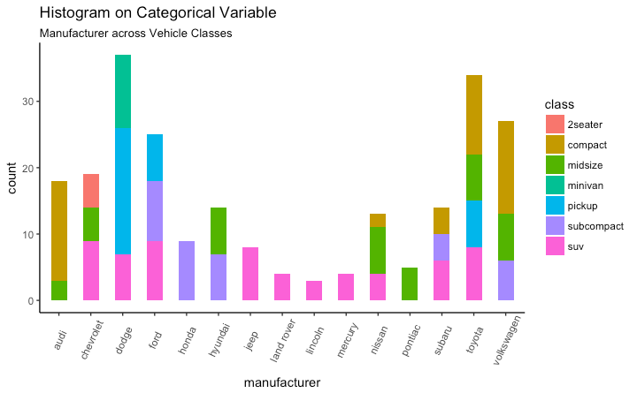

<a href="#top">[Back to Top]</a>

### <a name="Density Plot"></a>Density plot
```{r}
library(ggplot2)
theme_set(theme_classic())

# Plot
g <- ggplot(mpg, aes(cty))
g + geom_density(aes(fill=factor(cyl))) + 
    labs(title="Density plot", 
         subtitle="City Mileage Grouped by Number of cylinders",
         caption="Source: mpg",
         x="City Mileage",
         fill="# Cylinders")
```
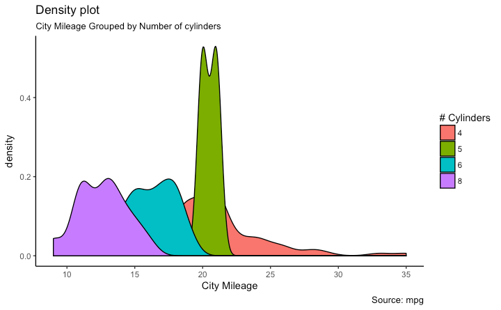

<a href="#top">[Back to Top]</a>

### <a name="Box Plot"></a>Box Plot
Box plot is an excellent tool to study the distribution. It can also show the distributions within multiple groups, along with the median, range and outliers if any. 

The dark line inside the box represents the median. The top of box is 75%ile and bottom of box is 25%ile. The end points of the lines (aka whiskers) is at a distance of 1.5*IQR, where IQR or Inter Quartile Range is the distance between 25th and 75th percentiles. The points outside the whiskers are marked as dots and are normally considered as extreme points.

Setting `varwidth=T` adjusts the width of the boxes to be proportional to the number of observation it contains.
```{r}
library(ggplot2)
theme_set(theme_classic())

# Plot
g <- ggplot(mpg, aes(class, cty))
g + geom_boxplot(varwidth=T, fill="plum") + 
    labs(title="Box plot", 
         subtitle="City Mileage grouped by Class of vehicle",
         caption="Source: mpg",
         x="Class of Vehicle",
         y="City Mileage")
```
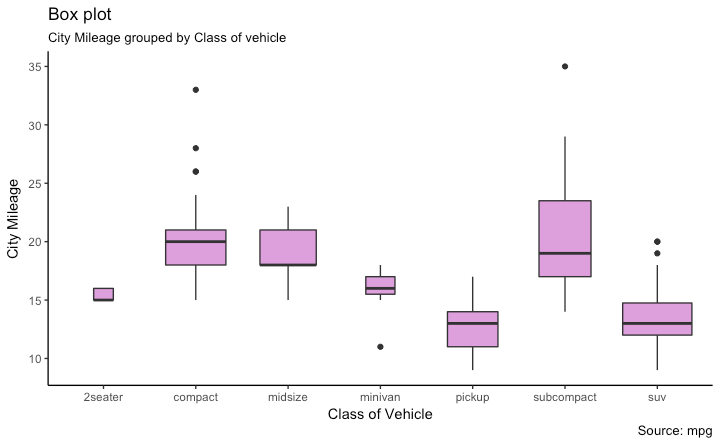

```{r}
library(ggthemes)
g <- ggplot(mpg, aes(class, cty))
g + geom_boxplot(aes(fill=factor(cyl))) + 
  theme(axis.text.x = element_text(angle=65, vjust=0.6)) + 
  labs(title="Box plot", 
       subtitle="City Mileage grouped by Class of vehicle",
       caption="Source: mpg",
       x="Class of Vehicle",
       y="City Mileage")
```
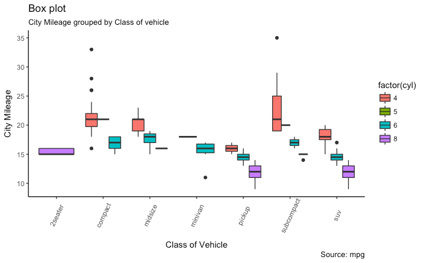

<a href="#top">[Back to Top]</a>

### <a name="Dot + Box Plot"></a>Dot + Box Plot 
On top of the information provided by a box plot, the dot plot can provide more clear information in the form of summary statistics by each group. The dots are staggered such that each dot represents one observation. So, in below chart, the number of dots for a given manufacturer will match the number of rows of that manufacturer in source data.

```{r}
library(ggplot2)
theme_set(theme_bw())

# plot
g <- ggplot(mpg, aes(manufacturer, cty))
g + geom_boxplot() + 
  geom_dotplot(binaxis='y', 
               stackdir='center', 
               dotsize = .5, 
               fill="red") +
  theme(axis.text.x = element_text(angle=65, vjust=0.6)) + 
  labs(title="Box plot + Dot plot", 
       subtitle="City Mileage vs Class: Each dot represents 1 row in source data",
       caption="Source: mpg",
       x="Class of Vehicle",
       y="City Mileage")
```


<a href="#top">[Back to Top]</a>

### <a name="Tufte Boxplot"></a>Tufte Boxplot
Tufte box plot, provided by `ggthemes` package is inspired by the works of Edward Tufte. Tufte's Box plot is just a box plot made minimal and visually appealing.
```{r}
library(ggthemes)
library(ggplot2)
theme_set(theme_tufte())  # from ggthemes

# plot
g <- ggplot(mpg, aes(manufacturer, cty))
g + geom_tufteboxplot() + 
      theme(axis.text.x = element_text(angle=65, vjust=0.6)) + 
      labs(title="Tufte Styled Boxplot", 
           subtitle="City Mileage grouped by Class of vehicle",
           caption="Source: mpg",
           x="Class of Vehicle",
           y="City Mileage")

```
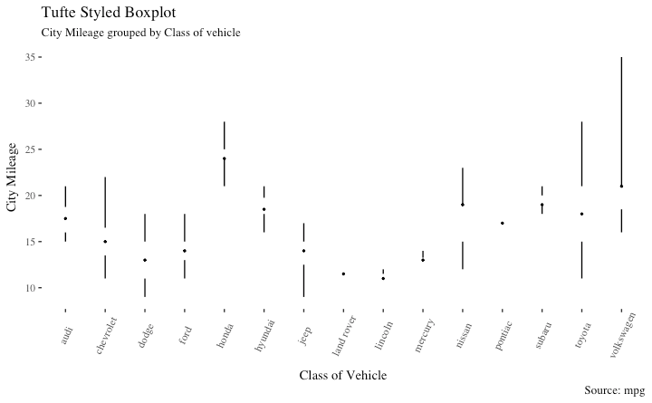

<a href="#top">[Back to Top]</a>

### <a name="Violin Plot"></a>Violin Plot
A violin plot is similar to box plot but shows the density within groups. Not much info provided as in boxplots. It can be drawn using `geom_violin()`.
```{r}
library(ggplot2)
theme_set(theme_bw())

# plot
g <- ggplot(mpg, aes(class, cty))
g + geom_violin() + 
  labs(title="Violin plot", 
       subtitle="City Mileage vs Class of vehicle",
       caption="Source: mpg",
       x="Class of Vehicle",
       y="City Mileage")
```
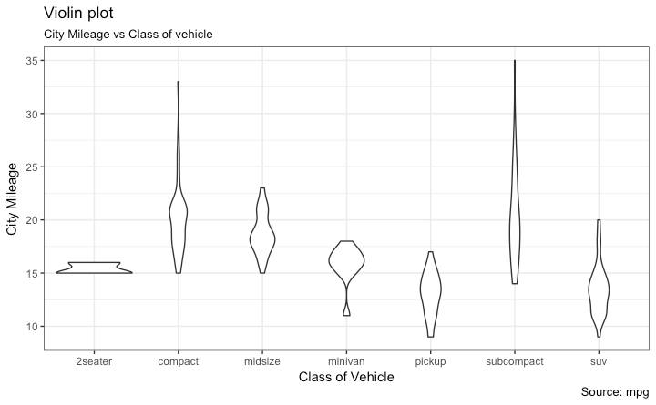

<a href="#top">[Back to Top]</a>

### <a name="Population Pyramid"></a>Population Pyramid

Population pyramids offer a unique way of visualizing how much population or what percentage of population fall under a certain category. The below pyramid is an excellent example of how many users are retained at each stage of a email marketing campaign funnel.

```{r}
library(ggplot2)
library(ggthemes)
options(scipen = 999)  # turns of scientific notations like 1e+40

# Read data
email_campaign_funnel <- read.csv("https://raw.githubusercontent.com/selva86/datasets/master/email_campaign_funnel.csv")

# X Axis Breaks and Labels 
brks <- seq(-15000000, 15000000, 5000000)
lbls = paste0(as.character(c(seq(15, 0, -5), seq(5, 15, 5))), "m")

# Plot
ggplot(email_campaign_funnel, aes(x = Stage, y = Users, fill = Gender)) +   # Fill column
                              geom_bar(stat = "identity", width = .6) +   # draw the bars
                              scale_y_continuous(breaks = brks,   # Breaks
                                                 labels = lbls) + # Labels
                              coord_flip() +  # Flip axes
                              labs(title="Email Campaign Funnel") +
                              theme_tufte() +  # Tufte theme from ggfortify
                              theme(plot.title = element_text(hjust = .5), 
                                    axis.ticks = element_blank()) +   # Centre plot title
                              scale_fill_brewer(palette = "Dark2")  # Color palette
```

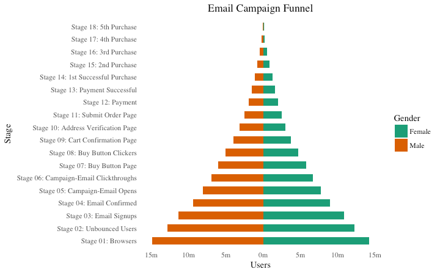

<a href="#top">[Back to Top]</a>

## 5. Composition

### <a name="Waffle Chart"></a>Waffle Chart

Waffle charts is a nice way of showing the categorical composition of the total population. Though there is no direct function, it can be articulated by smartly maneuvering the ggplot2 using `geom_tile()` function. The below template should help you create your own waffle.

```{r}
var <- mpg$class  # the categorical data 

## Prep data (nothing to change here)
nrows <- 10
df <- expand.grid(y = 1:nrows, x = 1:nrows)
categ_table <- round(table(var) * ((nrows*nrows)/(length(var))))
categ_table
#>   2seater    compact    midsize    minivan     pickup subcompact        suv 
#>         2         20         18          5         14         15         26 

df$category <- factor(rep(names(categ_table), categ_table))  
# NOTE: if sum(categ_table) is not 100 (i.e. nrows^2), it will need adjustment to make the sum to 100.

## Plot
ggplot(df, aes(x = x, y = y, fill = category)) + 
        geom_tile(color = "black", size = 0.5) +
        scale_x_continuous(expand = c(0, 0)) +
        scale_y_continuous(expand = c(0, 0), trans = 'reverse') +
        scale_fill_brewer(palette = "Set3") +
        labs(title="Waffle Chart", subtitle="'Class' of vehicles",
             caption="Source: mpg") + 
        theme(panel.border = element_rect(size = 2),
              plot.title = element_text(size = rel(1.2)),
              axis.text = element_blank(),
              axis.title = element_blank(),
              axis.ticks = element_blank(),
              legend.title = element_blank(),
              legend.position = "right")
```
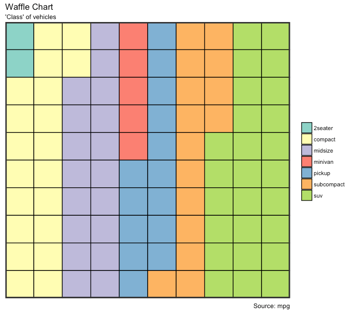

<a href="#top">[Back to Top]</a>

### <a name="Pie Chart"></a>Pie Chart
Pie chart, a classic way of showing the compositions is equivalent to the waffle chart in terms of the information conveyed. But is a slightly tricky to implement in ggplot2 using the `coord_polar()`.
```{r}
library(ggplot2)
theme_set(theme_classic())

# Source: Frequency table
df <- as.data.frame(table(mpg$class))
colnames(df) <- c("class", "freq")
pie <- ggplot(df, aes(x = "", y=freq, fill = factor(class))) + 
  geom_bar(width = 1, stat = "identity") +
  theme(axis.line = element_blank(), 
        plot.title = element_text(hjust=0.5)) + 
  labs(fill="class", 
       x=NULL, 
       y=NULL, 
       title="Pie Chart of class", 
       caption="Source: mpg")

pie + coord_polar(theta = "y", start=0)

# Source: Categorical variable.
# mpg$class
pie <- ggplot(mpg, aes(x = "", fill = factor(class))) + 
  geom_bar(width = 1) +
  theme(axis.line = element_blank(), 
        plot.title = element_text(hjust=0.5)) + 
  labs(fill="class", 
       x=NULL, 
       y=NULL, 
       title="Pie Chart of class", 
       caption="Source: mpg")
  
pie + coord_polar(theta = "y", start=0)
```
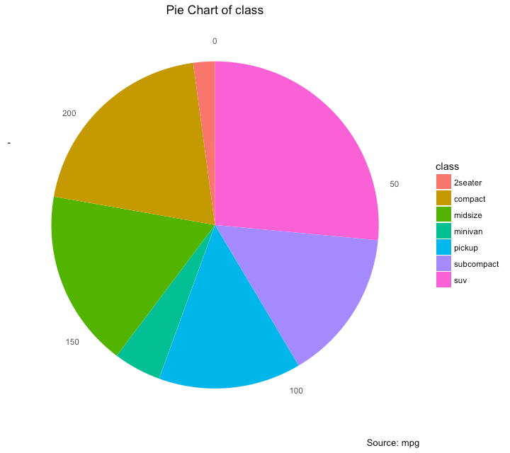

```{r}
# http://www.r-graph-gallery.com/128-ring-or-donut-plot/
```

<a href="#top">[Back to Top]</a>

### <a name="Treemap"></a>Treemap
Treemap is a nice way of displaying hierarchical data by using nested rectangles. The `treemapify` package provides the necessary functions to convert the data in desired format (`treemapify`) as well as draw the actual plot (`ggplotify`).

In order to create a treemap, the data must be converted to desired format using `treemapify()`. The important requirement is, your data must have one variable each that describes the `area` of the tiles, variable for `fill` color, variable that has the tile's `label ` and finally the parent `group`.

Once the data formatting is done, just call `ggplotify()` on the treemapified data.

```{r}
library(ggplot2) 
library(treemapify)
proglangs <- read.csv("https://raw.githubusercontent.com/selva86/datasets/master/proglanguages.csv")

# plot
treeMapCoordinates <- treemapify(proglangs,
                                 area = "value",
                                 fill = "parent",
                                 label = "id",
                                 group = "parent")

treeMapPlot <- ggplotify(treeMapCoordinates) + 
                  scale_x_continuous(expand = c(0, 0)) +
                  scale_y_continuous(expand = c(0, 0)) +
                  scale_fill_brewer(palette = "Dark2")

print(treeMapPlot)
```
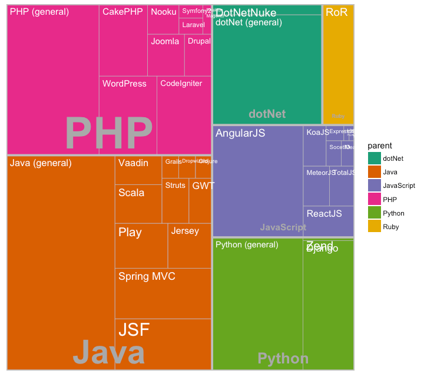

<a href="#top">[Back to Top]</a>

### <a name="Bar Chart"></a>Bar Chart
By default, `geom_bar()` has the `stat` set to `count`. That means, when you provide just a continuous X variable (and no Y variable), it tries to make a histogram out of the data. 

In order to make a bar chart create bars instead of histogram, you need to do two things. 

1. Set `stat=identity` 
2. Provide both `x` and `y` inside `aes()` where, `x` is either `character` or `factor` and `y` is numeric.

A bar chart can be drawn from a categorical column variable or from a separate frequency table. By adjusting `width`, you can adjust the thickness of the bars. If your data source is a frequency table, that is, if you don't want ggplot to compute the counts, you need to set the `stat=identity` inside the `geom_bar()`.

```{r}
# prep frequency table
freqtable <- table(mpg$manufacturer)
df <- as.data.frame.table(freqtable)
head(df)
#>          Var1 Freq
#> 1        audi   18
#> 2   chevrolet   19
#> 3       dodge   37
#> 4        ford   25
#> 5       honda    9
#> 6     hyundai   14
```

```{r}
# plot
library(ggplot2)
theme_set(theme_classic())

# Plot
g <- ggplot(df, aes(Var1, Freq))
g + geom_bar(stat="identity", width = 0.5, fill="tomato2") + 
      labs(title="Bar Chart", 
           subtitle="Manufacturer of vehicles", 
           caption="Source: Frequency of Manufacturers from 'mpg' dataset") +
      theme(axis.text.x = element_text(angle=65, vjust=0.6))
```
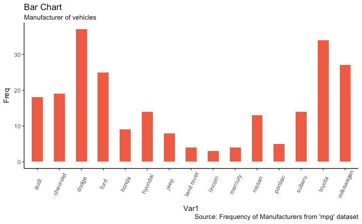

It can be computed directly from a column variable as well. In this case, only X is provided and `stat=identity` is _not_ set.
```{r}
# From on a categorical column variable
g <- ggplot(mpg, aes(manufacturer))
g + geom_bar(aes(fill=class), width = 0.5) + 
  theme(axis.text.x = element_text(angle=65, vjust=0.6)) +
  labs(title="Categorywise Bar Chart", 
       subtitle="Manufacturer of vehicles", 
       caption="Source: Manufacturers from 'mpg' dataset")
```


<a href="#top">[Back to Top]</a>

## 6. Change
### <a name="Time Series Plot From a Time Series Object"></a>Time Series Plot From a Time Series Object (`ts`)
The `ggfortify` package allows autoplot to automatically plot directly from a time series object (`ts`).
```{r}
## From Timeseries object (ts)
library(ggplot2)
library(ggfortify)
theme_set(theme_classic())

# Plot 
autoplot(AirPassengers) + 
  labs(title="AirPassengers") + 
  theme(plot.title = element_text(hjust=0.5))
```
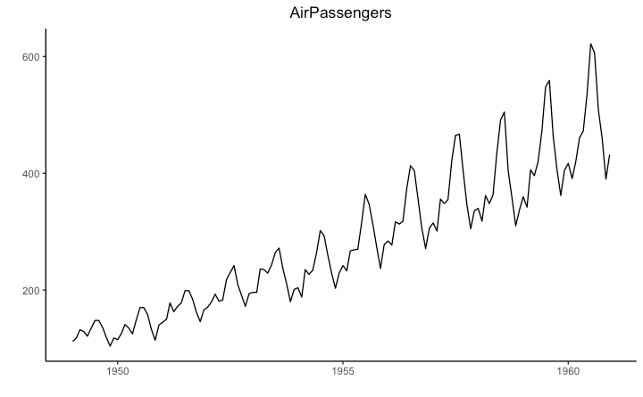

### <a name="Time Series Plot From a Data Frame"></a>Time Series Plot From a Data Frame

Using `geom_line()`, a time series (or line chart) can be drawn from a `data.frame` as well. The X axis breaks are generated by default. In below example, the breaks are formed once every 10 years.

#### Default X Axis Labels
```{r}
library(ggplot2)
theme_set(theme_classic())

# Allow Default X Axis Labels
ggplot(economics, aes(x=date)) + 
  geom_line(aes(y=returns_perc)) + 
  labs(title="Time Series Chart", 
       subtitle="Returns Percentage from 'Economics' Dataset", 
       caption="Source: Economics", 
       y="Returns %")
```
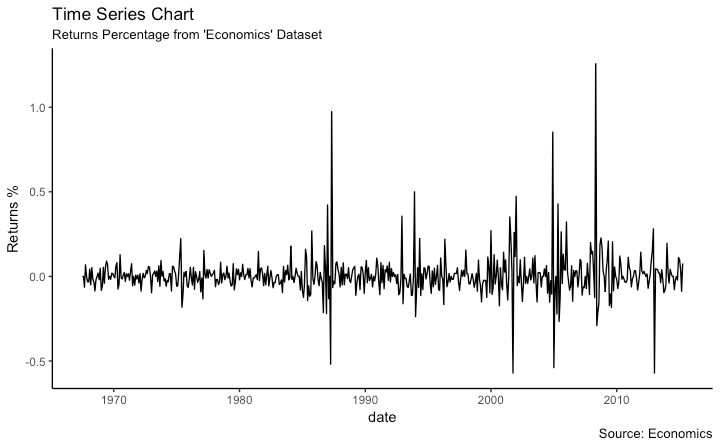

### <a name="Time Series Plot For a Monthly Time Series"></a>Time Series Plot For a _Monthly_ Time Series
If you want to set your own time intervals (breaks) in X axis, you need to set the breaks and labels using `scale_x_date()`.

```{r}
library(ggplot2)
library(lubridate)
theme_set(theme_bw())

economics_m <- economics[1:24, ]

# labels and breaks for X axis text
lbls <- paste0(month.abb[month(economics_m$date)], " ", lubridate::year(economics_m$date))
brks <- economics_m$date

# plot
ggplot(economics_m, aes(x=date)) + 
  geom_line(aes(y=returns_perc)) + 
  labs(title="Monthly Time Series", 
       subtitle="Returns Percentage from Economics Dataset", 
       caption="Source: Economics", 
       y="Returns %") +  # title and caption
  scale_x_date(labels = lbls, 
               breaks = brks) +  # change to monthly ticks and labels
  theme(axis.text.x = element_text(angle = 90, vjust=0.5),  # rotate x axis text
        panel.grid.minor = element_blank())  # turn off minor grid
```
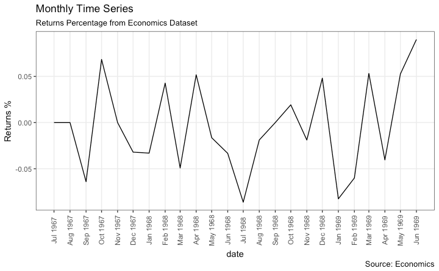

<a href="#top">[Back to Top]</a>

### <a name="Time Series Plot For a Yearly Time Series"></a>Time Series Plot For a _Yearly_ Time Series
```{r}
library(ggplot2)
library(lubridate)
theme_set(theme_bw())

economics_y <- economics[1:90, ]

# labels and breaks for X axis text
brks <- economics_y$date[seq(1, length(economics_y$date), 12)]
lbls <- lubridate::year(brks)

# plot
ggplot(economics_y, aes(x=date)) + 
  geom_line(aes(y=returns_perc)) + 
  labs(title="Yearly Time Series", 
       subtitle="Returns Percentage from Economics Dataset", 
       caption="Source: Economics", 
       y="Returns %") +  # title and caption
  scale_x_date(labels = lbls, 
               breaks = brks) +  # change to monthly ticks and labels
  theme(axis.text.x = element_text(angle = 90, vjust=0.5),  # rotate x axis text
        panel.grid.minor = element_blank())  # turn off minor grid
```
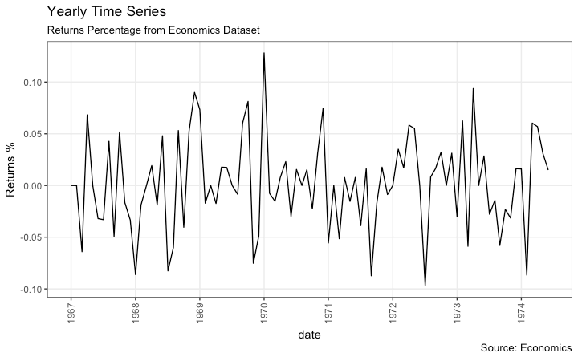

<a href="#top">[Back to Top]</a>

### <a name="Time Series Plot From Long Data Format"></a>Time Series Plot From Long Data Format: Multiple Time Series in Same Dataframe Column

In this example, I construct the ggplot from a long data format. That means, the column names and respective values of all the columns are stacked in just 2 variables (`variable` and `value` respectively). If you were to convert this data to wide format, it would look like the `economics` dataset.

In below example, the `geom_line` is drawn for `value` column and the `aes(col)` is set to `variable`. This way, with just one call to `geom_line`, multiple colored lines are drawn, one each for each unique value in `variable` column. The `scale_x_date()` changes the X axis breaks and labels, and `scale_color_manual` changes the color of the lines.

```{r}
data(economics_long, package = "ggplot2")
head(economics_long)
#>         date variable value      value01
#>       <date>   <fctr> <dbl>        <dbl>
#> 1 1967-07-01      pce 507.4 0.0000000000
#> 2 1967-08-01      pce 510.5 0.0002660008
#> 3 1967-09-01      pce 516.3 0.0007636797
#> 4 1967-10-01      pce 512.9 0.0004719369
#> 5 1967-11-01      pce 518.1 0.0009181318
#> 6 1967-12-01      pce 525.8 0.0015788435
```

```{r}
library(ggplot2)
library(lubridate)
theme_set(theme_bw())

df <- economics_long[economics_long$variable %in% c("psavert", "uempmed"), ]
df <- df[lubridate::year(df$date) %in% c(1967:1981), ]

# labels and breaks for X axis text
brks <- df$date[seq(1, length(df$date), 12)]
lbls <- lubridate::year(brks)

# plot
ggplot(df, aes(x=date)) + 
  geom_line(aes(y=value, col=variable)) + 
  labs(title="Time Series of Returns Percentage", 
       subtitle="Drawn from Long Data format", 
       caption="Source: Economics", 
       y="Returns %", 
       color=NULL) +  # title and caption
  scale_x_date(labels = lbls, breaks = brks) +  # change to monthly ticks and labels
  scale_color_manual(labels = c("psavert", "uempmed"), 
                     values = c("psavert"="#00ba38", "uempmed"="#f8766d")) +  # line color
  theme(axis.text.x = element_text(angle = 90, vjust=0.5, size = 8),  # rotate x axis text
        panel.grid.minor = element_blank())  # turn off minor grid
```
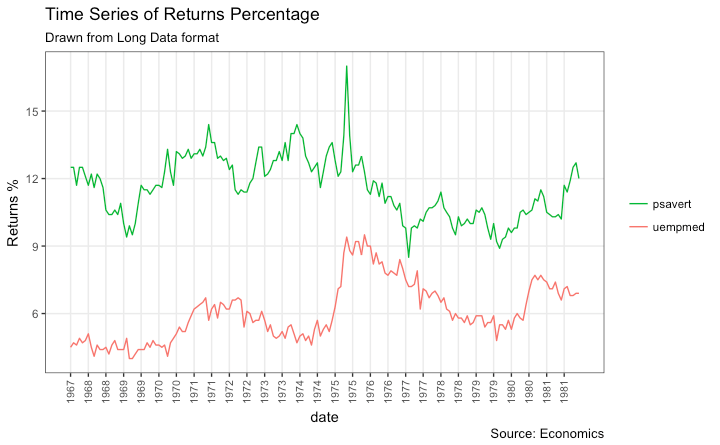

<a href="#top">[Back to Top]</a>

### <a name="Time Series Plot From Wide Data Format"></a>Time Series Plot From Wide Data Format: Data in Multiple Columns of Dataframe
As noted in the [part 2](Complete-Ggplot2-Tutorial-Part2-Customizing-Theme-With-R-Code.html#2. Modifying Legend) of this tutorial, whenever your plot's geom (like points, lines, bars, etc) changes the `fill`, `size`, `col`, `shape` or `stroke` based on another column, a legend is automatically drawn.

But if you are creating a time series (or even other types of plots) from a wide data format, you have to draw each line manually by calling `geom_line()` once for every line. So, a legend will not be drawn by default. 

However, having a legend would still be nice. This can be done using the `scale_aesthetic_manual()` format of functions (like, `scale_color_manual()` if only the color of your lines change). Using this function, you can give a legend title with the `name` argument, tell what color the legend should take with the `values` argument and also set the legend labels. 

Even though the below plot looks exactly like the previous one, the approach to construct this is different.

You might wonder why I used this function in previous example for long data format as well. Note that, in previous example, it was used to change the color of the line only. Without `scale_color_manual()`, you would still have got a legend, but the lines would be of a different (default) color. But in current example, without `scale_color_manual()`, you wouldn't even have a legend. Try it out!

```{r}
library(ggplot2)
library(lubridate)
theme_set(theme_bw())

df <- economics[, c("date", "psavert", "uempmed")]
df <- df[lubridate::year(df$date) %in% c(1967:1981), ]

# labels and breaks for X axis text
brks <- df$date[seq(1, length(df$date), 12)]
lbls <- lubridate::year(brks)

# plot
ggplot(df, aes(x=date)) + 
  geom_line(aes(y=psavert, col="psavert")) + 
  geom_line(aes(y=uempmed, col="uempmed")) + 
  labs(title="Time Series of Returns Percentage", 
       subtitle="Drawn From Wide Data format", 
       caption="Source: Economics", y="Returns %") +  # title and caption
  scale_x_date(labels = lbls, breaks = brks) +  # change to monthly ticks and labels
  scale_color_manual(name="", 
                     values = c("psavert"="#00ba38", "uempmed"="#f8766d")) +  # line color
  theme(panel.grid.minor = element_blank())  # turn off minor grid
```
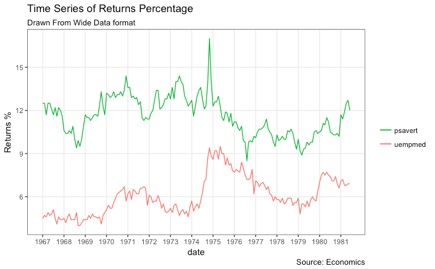

<a href="#top">[Back to Top]</a>

### <a name="Stacked Area Chart"></a>Stacked Area Chart
Stacked area chart is just like a line chart, except that the region below the plot is all colored. This is typically used when:

1. You want to describe how a quantity or volume (rather than something like price) changed over time
2. You have many data points. For very few data points, consider plotting a bar chart.
3. You want to show the contribution from individual components.

This can be plotted using `geom_area` which works very much like `geom_line`. But there is an important point to note. By default, each `geom_area()` starts from the bottom of Y axis (which is typically 0), but, if you want to show the contribution from individual components, you want the `geom_area` to be stacked over the top of previous component, rather than the floor of the plot itself. So, you have to add all the bottom layers while setting the `y` of `geom_area`. 

In below example, I have set it as `y=psavert+uempmed` for the topmost `geom_area()`.

However nice the plot looks, the caveat is that, it can easily become complicated and uninterprettable if there are too many components. 

```{r}
library(ggplot2)
library(lubridate)
theme_set(theme_bw())

df <- economics[, c("date", "psavert", "uempmed")]
df <- df[lubridate::year(df$date) %in% c(1967:1981), ]

# labels and breaks for X axis text
brks <- df$date[seq(1, length(df$date), 12)]
lbls <- lubridate::year(brks)

# plot
ggplot(df, aes(x=date)) + 
  geom_area(aes(y=psavert+uempmed, fill="psavert")) + 
  geom_area(aes(y=uempmed, fill="uempmed")) + 
  labs(title="Area Chart of Returns Percentage", 
       subtitle="From Wide Data format", 
       caption="Source: Economics", 
       y="Returns %") +  # title and caption
  scale_x_date(labels = lbls, breaks = brks) +  # change to monthly ticks and labels
  scale_fill_manual(name="", 
                    values = c("psavert"="#00ba38", "uempmed"="#f8766d")) +  # line color
  theme(panel.grid.minor = element_blank())  # turn off minor grid
```
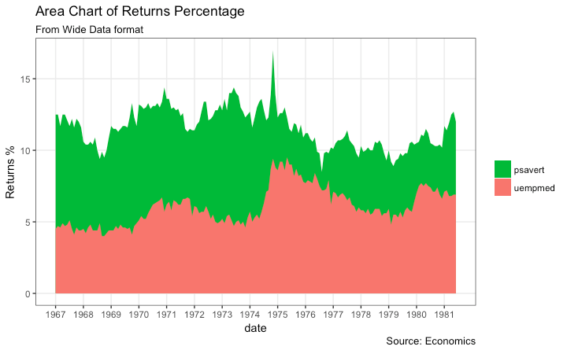

<a href="#top">[Back to Top]</a>

### <a name="Calendar Heatmap"></a>Calendar Heatmap
When you want to see the variation, especially the highs and lows, of a metric like stock price, on an actual calendar itself, the calendar heat map is a great tool. It emphasizes the variation visually over time rather than the actual value itself.

This can be implemented using the `geom_tile`. But getting it in the right format has more to do with the data preparation rather than the plotting itself.

```{r}
# http://margintale.blogspot.in/2012/04/ggplot2-time-series-heatmaps.html
library(ggplot2)
library(plyr)
library(scales)
library(zoo)

df <- read.csv("https://raw.githubusercontent.com/selva86/datasets/master/yahoo.csv")
df$date <- as.Date(df$date)  # format date
df <- df[df$year >= 2012, ]  # filter reqd years

# Create Month Week
df$yearmonth <- as.yearmon(df$date)
df$yearmonthf <- factor(df$yearmonth)
df <- ddply(df,.(yearmonthf), transform, monthweek=1+week-min(week))  # compute week number of month
df <- df[, c("year", "yearmonthf", "monthf", "week", "monthweek", "weekdayf", "VIX.Close")]
head(df)
#>   year yearmonthf monthf week monthweek weekdayf VIX.Close
#> 1 2012   Jan 2012    Jan    1         1      Tue     22.97
#> 2 2012   Jan 2012    Jan    1         1      Wed     22.22
#> 3 2012   Jan 2012    Jan    1         1      Thu     21.48
#> 4 2012   Jan 2012    Jan    1         1      Fri     20.63
#> 5 2012   Jan 2012    Jan    2         2      Mon     21.07
#> 6 2012   Jan 2012    Jan    2         2      Tue     20.69


# Plot
ggplot(df, aes(monthweek, weekdayf, fill = VIX.Close)) + 
  geom_tile(colour = "white") + 
  facet_grid(year~monthf) + 
  scale_fill_gradient(low="red", high="green") +
  labs(x="Week of Month",
       y="",
       title = "Time-Series Calendar Heatmap", 
       subtitle="Yahoo Closing Price", 
       fill="Close")
```
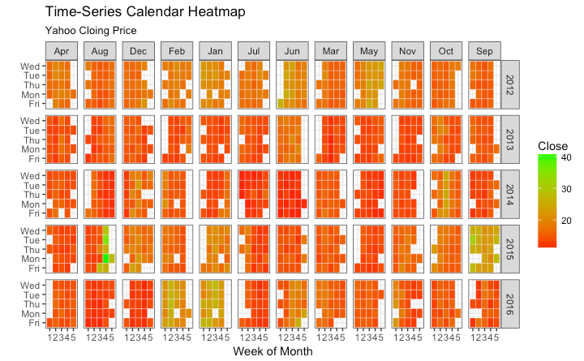

<a href="#top">[Back to Top]</a>

### <a name="Slope Chart 2"></a>Slope Chart
Slope chart is a great tool of you want to visualize change in value and ranking between categories. This is more suitable over a time series when there are very few time points.
```{r}
library(dplyr)
theme_set(theme_classic())
source_df <- read.csv("https://raw.githubusercontent.com/jkeirstead/r-slopegraph/master/cancer_survival_rates.csv")

# Define functions. Source: https://github.com/jkeirstead/r-slopegraph
tufte_sort <- function(df, x="year", y="value", group="group", method="tufte", min.space=0.05) {
    ## First rename the columns for consistency
    ids <- match(c(x, y, group), names(df))
    df <- df[,ids]
    names(df) <- c("x", "y", "group")

    ## Expand grid to ensure every combination has a defined value
    tmp <- expand.grid(x=unique(df$x), group=unique(df$group))
    tmp <- merge(df, tmp, all.y=TRUE)
    df <- mutate(tmp, y=ifelse(is.na(y), 0, y))
  
    ## Cast into a matrix shape and arrange by first column
    require(reshape2)
    tmp <- dcast(df, group ~ x, value.var="y")
    ord <- order(tmp[,2])
    tmp <- tmp[ord,]
    
    min.space <- min.space*diff(range(tmp[,-1]))
    yshift <- numeric(nrow(tmp))
    ## Start at "bottom" row
    ## Repeat for rest of the rows until you hit the top
    for (i in 2:nrow(tmp)) {
        ## Shift subsequent row up by equal space so gap between
        ## two entries is >= minimum
        mat <- as.matrix(tmp[(i-1):i, -1])
        d.min <- min(diff(mat))
        yshift[i] <- ifelse(d.min < min.space, min.space - d.min, 0)
    }

    
    tmp <- cbind(tmp, yshift=cumsum(yshift))

    scale <- 1
    tmp <- melt(tmp, id=c("group", "yshift"), variable.name="x", value.name="y")
    ## Store these gaps in a separate variable so that they can be scaled ypos = a*yshift + y

    tmp <- transform(tmp, ypos=y + scale*yshift)
    return(tmp)
   
}

plot_slopegraph <- function(df) {
    ylabs <- subset(df, x==head(x,1))$group
    yvals <- subset(df, x==head(x,1))$ypos
    fontSize <- 3
    gg <- ggplot(df,aes(x=x,y=ypos)) +
        geom_line(aes(group=group),colour="grey80") +
        geom_point(colour="white",size=8) +
        geom_text(aes(label=y), size=fontSize, family="American Typewriter") +
        scale_y_continuous(name="", breaks=yvals, labels=ylabs)
    return(gg)
}    

## Prepare data    
df <- tufte_sort(source_df, 
                 x="year", 
                 y="value", 
                 group="group", 
                 method="tufte", 
                 min.space=0.05)

df <- transform(df, 
                x=factor(x, levels=c(5,10,15,20), 
                            labels=c("5 years","10 years","15 years","20 years")), 
                y=round(y))

## Plot
plot_slopegraph(df) + labs(title="Estimates of % survival rates") + 
                      theme(axis.title=element_blank(),
                            axis.ticks = element_blank(),
                            plot.title = element_text(hjust=0.5,
                                                      family = "American Typewriter",
                                                      face="bold"),
                            axis.text = element_text(family = "American Typewriter",
                                                     face="bold"))
```
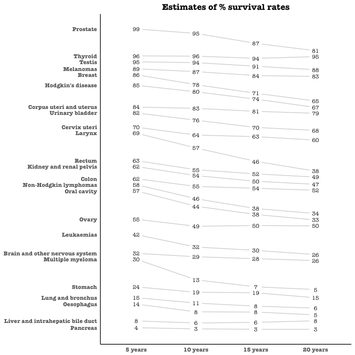

<a href="#top">[Back to Top]</a>

### <a name="Seasonal Plot"></a>Seasonal Plot 
If you are working with a time series object of class `ts` or `xts`, you can view the seasonal fluctuations through a seasonal plot drawn using `forecast::ggseasonplot`. Below is an example using the native `AirPassengers` and `nottem` time series.

You can see the traffic increase in air passengers over the years along with the repetitive seasonal patterns in traffic. Whereas Nottingham does not show an increase in overal temperatures over the years, but they definitely follow a seasonal pattern.

```{r}
library(ggplot2)
library(forecast)
theme_set(theme_classic())

# Subset data
nottem_small <- window(nottem, start=c(1920, 1), end=c(1925, 12))  # subset a smaller timewindow

# Plot
ggseasonplot(AirPassengers) + labs(title="Seasonal plot: International Airline Passengers")
ggseasonplot(nottem_small) + labs(title="Seasonal plot: Air temperatures at Nottingham Castle")
```
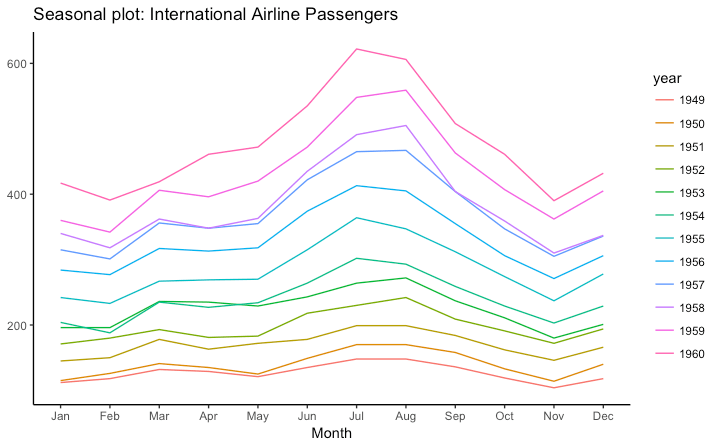
<br>
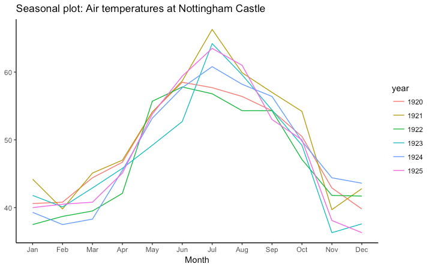

<a href="#top">[Back to Top]</a>

## 7. Groups
### <a name="Hierarchical Dendrogram"></a>Hierarchical Dendrogram
```{r}
# install.packages("ggdendro")
library(ggplot2)
library(ggdendro)
theme_set(theme_bw())

hc <- hclust(dist(USArrests), "ave")  # hierarchical clustering

# plot
ggdendrogram(hc, rotate = TRUE, size = 2)
```
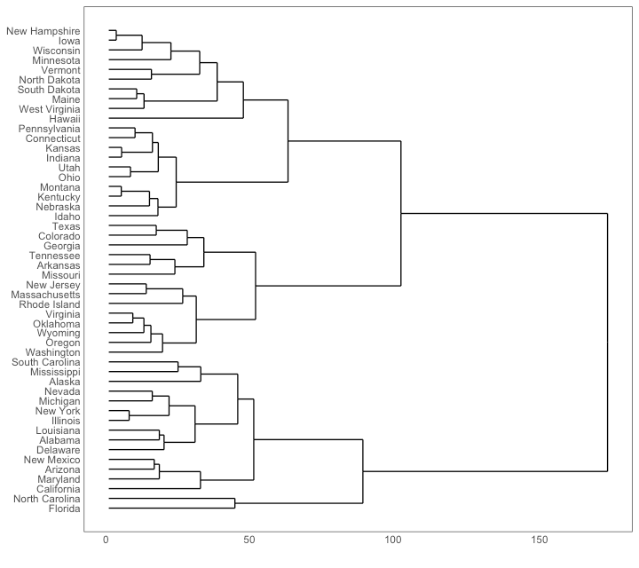

<a href="#top">[Back to Top]</a>

### <a name="Clusters"></a>Clusters
It is possible to show the distinct clusters or groups using `geom_encircle()`. If the dataset has multiple weak features, you can compute the principal components and draw a scatterplot using PC1 and PC2 as X and Y axis. 

The `geom_encircle()` can be used to encircle the desired groups. The only thing to note is the `data` argument to `geom_circle()`. You need to provide a subsetted dataframe that contains only the observations (rows) that belong to the group as the `data` argument.

```{r}
# devtools::install_github("hrbrmstr/ggalt")
library(ggplot2)
library(ggalt)
library(ggfortify)
theme_set(theme_classic())

# Compute data with principal components ------------------
df <- iris[c(1, 2, 3, 4)]
pca_mod <- prcomp(df)  # compute principal components

# Data frame of principal components ----------------------
df_pc <- data.frame(pca_mod$x, Species=iris$Species)  # dataframe of principal components
df_pc_vir <- df_pc[df_pc$Species == "virginica", ]  # df for 'virginica'
df_pc_set <- df_pc[df_pc$Species == "setosa", ]  # df for 'setosa'
df_pc_ver <- df_pc[df_pc$Species == "versicolor", ]  # df for 'versicolor'
 
# Plot ----------------------------------------------------
ggplot(df_pc, aes(PC1, PC2, col=Species)) + 
  geom_point(aes(shape=Species), size=2) +   # draw points
  labs(title="Iris Clustering", 
       subtitle="With principal components PC1 and PC2 as X and Y axis",
       caption="Source: Iris") + 
  coord_cartesian(xlim = 1.2 * c(min(df_pc$PC1), max(df_pc$PC1)), 
                  ylim = 1.2 * c(min(df_pc$PC2), max(df_pc$PC2))) +   # change axis limits
  geom_encircle(data = df_pc_vir, aes(x=PC1, y=PC2)) +   # draw circles
  geom_encircle(data = df_pc_set, aes(x=PC1, y=PC2)) + 
  geom_encircle(data = df_pc_ver, aes(x=PC1, y=PC2))
```
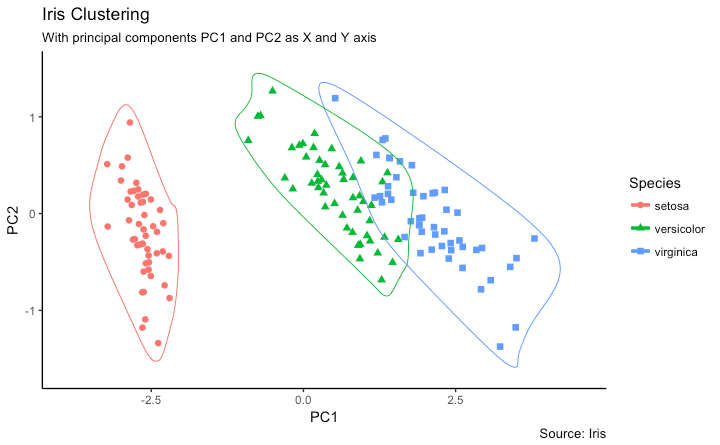

<a href="#top">[Back to Top]</a>

## 8. Spatial
The `ggmap` package provides facilities to interact with the google maps api and get the coordinates (latitude and longitude) of places you want to plot. The below example shows satellite, road and hybrid maps of the city of Chennai, encircling some of the places. I used the `geocode()` function to get the coordinates of these places and `qmap()` to get the maps. The type of map to fetch is determined by the value you set to the `maptype`.

You can also zoom into the map by setting the `zoom` argument. The default is 10 (suitable for large cities). Reduce this number (up to 3) if you want to zoom out. It can be zoomed in till 21, suitable for buildings.

```{r}
# Better install the dev versions ----------
# devtools::install_github("dkahle/ggmap")
# devtools::install_github("hrbrmstr/ggalt")

# load packages
library(ggplot2)
library(ggmap)
library(ggalt)

# Get Chennai's Coordinates --------------------------------
chennai <-  geocode("Chennai")  # get longitude and latitude

# Get the Map ----------------------------------------------
# Google Satellite Map
chennai_ggl_sat_map <- qmap("chennai", zoom=12, source = "google", maptype="satellite")  

# Google Road Map
chennai_ggl_road_map <- qmap("chennai", zoom=12, source = "google", maptype="roadmap")  

# Google Hybrid Map
chennai_ggl_hybrid_map <- qmap("chennai", zoom=12, source = "google", maptype="hybrid")  

# Open Street Map
chennai_osm_map <- qmap("chennai", zoom=12, source = "osm")   

# Get Coordinates for Chennai's Places ---------------------
chennai_places <- c("Kolathur",
                    "Washermanpet",
                    "Royapettah",
                    "Adyar",
                    "Guindy")

places_loc <- geocode(chennai_places)  # get longitudes and latitudes


# Plot Open Street Map -------------------------------------
chennai_osm_map + geom_point(aes(x=lon, y=lat),
                             data = places_loc, 
                             alpha = 0.7, 
                             size = 7, 
                             color = "tomato") + 
                  geom_encircle(aes(x=lon, y=lat),
                                data = places_loc, size = 2, color = "blue")

# Plot Google Road Map -------------------------------------
chennai_ggl_road_map + geom_point(aes(x=lon, y=lat),
                                  data = places_loc, 
                                  alpha = 0.7, 
                                  size = 7, 
                                  color = "tomato") + 
                       geom_encircle(aes(x=lon, y=lat),
                                     data = places_loc, size = 2, color = "blue")

# Google Hybrid Map ----------------------------------------
chennai_ggl_hybrid_map + geom_point(aes(x=lon, y=lat),
                                     data = places_loc, 
                                     alpha = 0.7, 
                                     size = 7, 
                                     color = "tomato") + 
                          geom_encircle(aes(x=lon, y=lat),
                                        data = places_loc, size = 2, color = "blue")

```

### Open Street Map <a name="Open Street Map"></a>

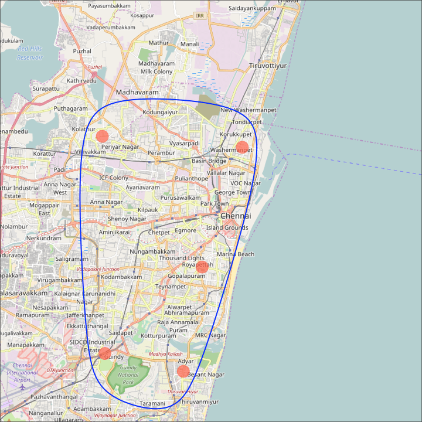

<a href="#top">[Back to Top]</a>

### Google Road Map <a name="Google Road Map"></a>

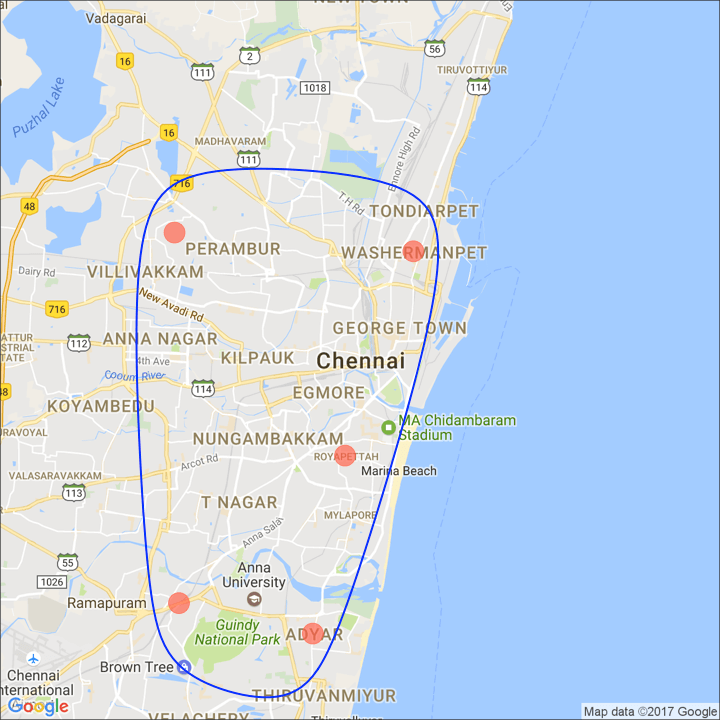

<a href="#top">[Back to Top]</a>

### Google Hybrid Map <a name="Google Hybrid Map"></a>

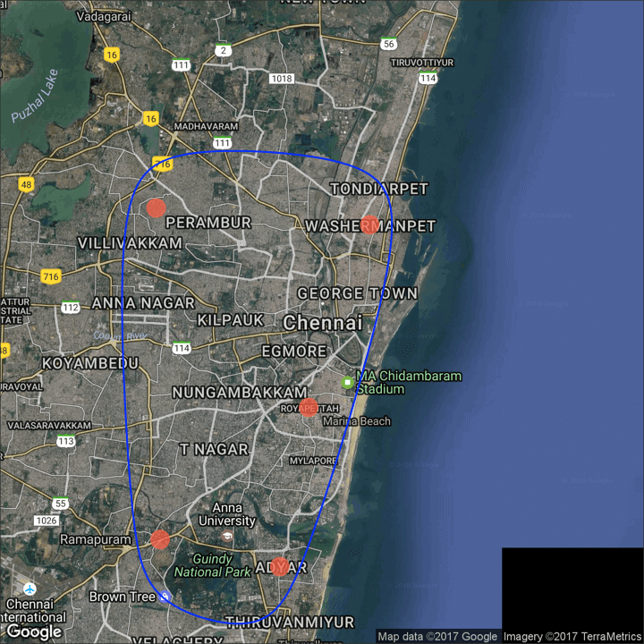

<a href="#top">[Back to Top]</a>

___________________________________________________

Have a suggestion or found a bug? Notify [here.](https://docs.google.com/forms/d/e/1FAIpQLSeIJmlvwe562R7JVpi5J2ydLyhk5-7OrGRMFGYrMJvjPal8eA/viewform)

_**Editors Note:** The [mastering R programming](packtpub.com/big-data-and-business-intelligence/mastering-r-programming-video) video course has a dedicated section for ggplot2 where the concepts are demonstrated in detail. Additionally it includes solving real coding challenges at the end of every video lesson._

